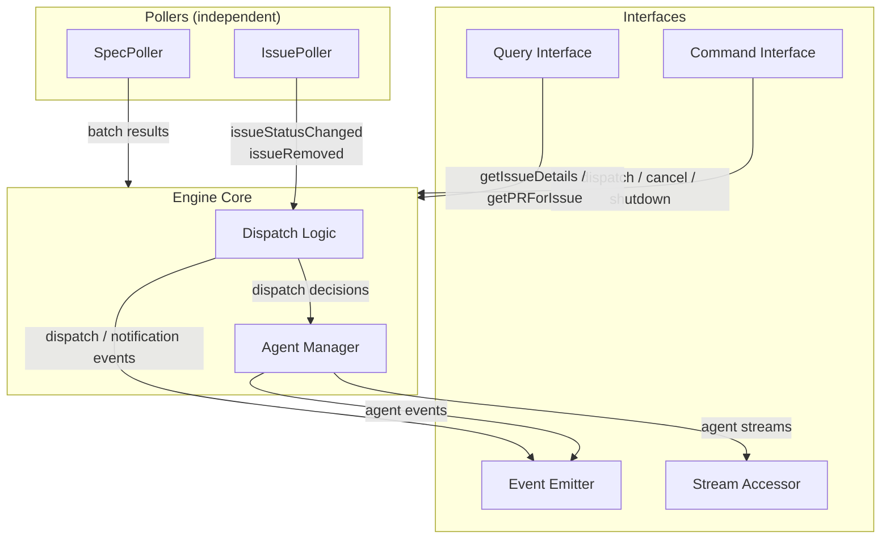

# Control Plane Engine

## Overview

The engine is the core module of the control plane. It orchestrates independent pollers that monitor GitHub for state changes, classifies detected changes into dispatch tiers, manages agent sessions, and handles recovery. The engine has no knowledge of the TUI — it exposes four interfaces (event emitter, command interface, query interface, and stream accessor) that the TUI (or any other consumer) can use.

## Constraints

- Must not import or reference the TUI module.
- Must not crash on transient errors (GitHub API failures, network errors). Log and retry next cycle.
- Must not dispatch more than one agent per task issue at a time.
- Must not auto-dispatch the Planner for specs without `status: approved` in frontmatter.
- Must reset `status:in-progress` issues to `status:pending` when no agent is running for them (startup recovery and crash recovery).
- Must use `@octokit/rest` with `@octokit/auth-app` as the authentication strategy for all GitHub API interactions. Octokit is an implementation detail of the GitHub Client adapter — all engine code interacts with the `GitHubClient` interface, never with Octokit directly. No type assertions (`as`) are permitted at the adapter boundary or anywhere `GitHubClient` is consumed.
- Must use `@anthropic-ai/claude-agent-sdk` for all agent invocations.
- Must detect spec changes remotely (via GitHub API), not from the local filesystem.
- GitHub write operations are limited to recovery (status label resets). All other writes are performed by agents.

## Specification

### Architecture

The engine consists of three layers:



- **Pollers** — Independent units that each monitor a single data source on their own interval. Pollers are pure sensors — they detect state changes and report results. IssuePoller emits events directly; SpecPoller returns batched results to the Engine Core. They do not make dispatch decisions.
- **Engine Core** — Receives poller events, classifies them by dispatch tier, and manages agent sessions. Owns dispatch policy and agent lifecycle.
- **Interfaces** — Event emitter (outbound state changes), command interface (inbound user actions), query interface (on-demand data fetching), and stream accessor (live agent output). All consumed by the TUI.

Each poller maintains its own snapshot slice. A failure in one poller does not affect others.

### GitHub Client

The engine accesses GitHub through a `GitHubClient` interface — a narrow, explicitly-typed contract covering only the API methods the engine uses. The `createGitHubClient` factory constructs an Octokit instance internally and returns a thin adapter that satisfies `GitHubClient` without type assertions.

**Why a wrapper:** Octokit's deeply generic types do not structurally match a narrow interface, even when the methods are compatible at runtime. Casting (`as unknown as GitHubClient`) would hide real mismatches. Instead, each adapter method explicitly calls the corresponding Octokit method and returns the result through a properly-typed function signature. The wrappers are 1:1 delegations — no transformation, no error mapping, no retry logic. They exist solely to bridge the type gap.

**Factory:** `createGitHubClient(config: GitHubClientConfig): GitHubClient`

The factory:

1. Creates an `Octokit` instance with `createAppAuth` as the auth strategy, using the provided `appID`, `privateKey`, and `installationID`.
2. Returns an object satisfying `GitHubClient` where each method delegates to the corresponding Octokit method.

**Module location:** `engine/github-client/`. The module contains:

- `types.ts` — `GitHubClientConfig`, `GitHubClient`, and all param/result types.
- `create-github-client.ts` — The adapter factory. Imports `Octokit` from `@octokit/rest` and `createAppAuth` from `@octokit/auth-app`. This is the only file in the engine that imports from `@octokit/*`.

**Octokit isolation:** No file outside `engine/github-client/` may import from `@octokit/rest` or `@octokit/auth-app`. This ensures Octokit is a swappable implementation detail.

**Caller responsibility:** The caller reads the private key from disk and passes the PEM content as a string. The adapter does not perform filesystem I/O.

**Auth validation:** `@octokit/auth-app` validates credentials lazily — the first API call triggers JWT creation and token exchange, not the `createGitHubClient` call itself. If credentials are invalid (bad key, wrong app ID, etc.), the first poller cycle will fail. The engine's error handling (log and retry next cycle) applies, but since invalid credentials never self-heal, this will fail indefinitely. This is acceptable for v1 — invalid credentials are a deployment misconfiguration, caught immediately on first cycle. The operator must fix the config and restart.

### Pollers

#### IssuePoller

Monitors GitHub Issues for status label changes.

**Poll cycle:**

1. Query open issues with the `task:implement` label via `GitHubClient`. Only `task:implement` issues are tracked — `task:refinement` issues are outside the control plane's scope (they do not have status transitions that drive agent dispatch).
2. For each issue, compare the current `status:*` label against the snapshot.
3. For each change, emit `issueStatusChanged` with the issue number, old status, and new status.
4. Update the snapshot.

**Snapshot state:**

| Field | Description |
|-------|-------------|
| Issue number | GitHub Issue number |
| Title | Issue title |
| Status label | Current `status:*` label value |
| Priority label | Current `priority:*` label value |
| Creation date | ISO 8601 timestamp |

**Change detection:** Only `status:*` label changes trigger `issueStatusChanged` events. Title, priority, and creation date are included in the event payload for convenience (the IssuePoller already has this data from the API response) but changes to these fields alone do not trigger events. The snapshot tracks them so they can be included in future events.

**Closed issue detection:** On each poll cycle, the IssuePoller compares the set of issue numbers in the API response against the snapshot. Issues present in the snapshot but absent from the response have been closed or had their `task:implement` label removed. For each removed issue, if an agent is running for it, the engine cancels the agent session (treated as failure — `agentFailed` emitted, worktree preserved if Implementor). The IssuePoller then emits `issueRemoved` for each and removes them from the snapshot.

**Initial poll cycle:** On the first cycle, the snapshot is empty. All detected issues are treated as new — each emits an `issueStatusChanged` event with `oldStatus: null`. This is how the engine populates the initial issue set. The dispatch logic treats `oldStatus: null` the same as any other status change for tier classification.

**Startup burst:** This means the first poll cycle may trigger dispatch actions for all existing issues simultaneously: auto-dispatching Reviewers for all `status:review` issues, emitting `dispatchReady` for all `status:pending` issues, and emitting notifications for all `status:needs-refinement`/`status:blocked` issues. This is intentional — if the control plane starts (or restarts), it should bring the system to the correct state. Startup recovery completes before the first poll cycle, so `status:in-progress` issues will already be reset to `status:pending`.

#### SpecPoller

Monitors the specs directory on the default branch for changes, using the GitHub Trees API.

**Poll cycle:**

1. Fetch the tree SHA of the specs directory on the default branch via `GitHubClient`.
2. Compare the tree SHA against the snapshot.
3. If unchanged — done, no further API calls.
4. If changed — fetch the full tree to identify which files were added, modified, or removed.
5. For each changed file, fetch its content via `repos.getContent` (returns base64-encoded content), decode it, and parse the frontmatter `status` value.
6. Fetch the HEAD commit SHA of the default branch (for spec diff URLs in the TUI). Note: this is the current HEAD commit, not necessarily the specific commit that modified each spec file. If multiple commits were pushed between poll cycles, the diff URL shows the HEAD commit's full diff, not a per-file change view. This is a known limitation — acceptable because the notification identifies the changed file path, giving the user enough context to find the relevant changes.
7. Return the complete batch of changes to the Engine Core.
8. Update the snapshot.

The SpecPoller returns results synchronously to the Engine Core rather than emitting events directly. The Engine Core then emits individual `specChanged` events per file (for the TUI's notification history) and separately passes the full batch of approved spec paths to the dispatch logic for a single Planner invocation. The per-file events are not the input to Planner dispatch — the Engine Core passes the batch directly. This ensures reliable batching.

**Snapshot state:**

| Field | Description |
|-------|-------------|
| Tree SHA | SHA of the specs directory tree on the default branch |
| Per-file status | Map of file path → frontmatter `status` value |

The tree SHA comparison makes the common case (nothing changed) a single API call. Detailed file inspection only happens when the tree SHA differs.

**Removed specs:** If a spec file is deleted, the SpecPoller removes it from its per-file snapshot. No `specChanged` event is emitted for removals — existing task issues for the removed spec are unaffected. The Planner is not notified of removals.

### Dispatch Logic

The engine core listens to poller events and classifies each into a dispatch tier. Dispatch logic is centralized — pollers never dispatch agents.

#### Auto-dispatch

The engine invokes the agent automatically with no user action.

| Poller Event | Agent | Condition |
|-------------|-------|-----------|
| `specChanged` | Planner | Spec frontmatter `status` is `approved` |
| `issueStatusChanged` to `status:review` | Reviewer | No agent already running for this issue |

The Planner is invoked once per SpecPoller cycle with all changed (and approved) spec paths batched into a single invocation. The Engine Core receives the full batch from the SpecPoller synchronously and passes approved paths to a single Planner dispatch.

**Planner concurrency guard:** Only one Planner session may run at a time. If a SpecPoller cycle detects changes while a Planner is already running, the engine emits `agentSkipped` for the Planner and defers the batch. The Engine Core maintains a deferred paths buffer (a set of file paths, deduplicated) for this purpose. On each subsequent SpecPoller cycle, the Engine Core merges the deferred buffer with the new cycle's results (union, deduplicated). The approval filter (`status: approved`) is applied to the merged set at dispatch time — paths whose frontmatter status changed to non-approved since deferral are dropped. The deferred buffer is cleared when the Planner is successfully dispatched.

**Planner idempotency:** The engine does not prevent re-dispatch for the same spec (e.g., a whitespace-only change to an approved spec will re-trigger the Planner). The Planner agent definition is responsible for idempotency — checking existing issues before creating new ones. See `agent-planner.md`.

The Reviewer is invoked per issue — one Reviewer per issue that entered `status:review`.

#### User-dispatch

The engine emits a `dispatchReady` event surfacing the issue to the TUI. The user decides when (or whether) to dispatch.

| Poller Event | Agent |
|-------------|-------|
| `issueStatusChanged` to `status:pending` | Implementor |
| `issueStatusChanged` to `status:unblocked` | Implementor |
| `issueStatusChanged` to `status:needs-changes` | Implementor |

User-dispatch items are surfaced on first detection (status differs from snapshot). They are not re-surfaced on subsequent polls if the status has not changed again.

#### Notify-only

The engine emits a notification event. No agent is dispatched.

| Poller Event | Notification |
|-------------|-------------|
| `issueStatusChanged` to `status:needs-refinement` | Clipboard-ready CLI command for the Human to address the spec issue. Includes resolution guidance: "After amending the spec, change the label to `status:unblocked`." `contextURL`: issue URL. |
| `issueStatusChanged` to `status:blocked` | Notification with issue URL for the Human to investigate the blocker. Includes resolution guidance: "After resolving the blocker, change the label to `status:unblocked`." `contextURL`: issue URL. |
| `issueStatusChanged` to `status:approved` | Notification that the issue is ready for Human to merge. `contextURL`: PR URL (via async `getPRForIssue` lookup — same pattern as `agentCompleted` Implementor: issue URL initially, updated to PR URL when resolved). |

**Clipboard command format** for `status:needs-refinement`:

```
claude -p "Use /spec-writing to address the spec refinement needed for issue #<N>. See blocker comment: https://github.com/<owner>/<repo>/issues/<N>"
```

This gives the Human a ready-to-paste command to kick off a spec amendment workflow outside the control plane. The `/spec-writing` skill handles the structured spec authoring process.

Notifications are dismissed automatically when the underlying issue's status changes to a different value on a subsequent poll.

**Dispatch fallthrough:** Status changes to values not listed in any dispatch tier (e.g., `in-progress`) trigger no dispatch action. The `issueStatusChanged` event is still emitted so the TUI can update the issue's state indicator.

### Event Emitter

The engine emits typed events for discrete state changes. Events drive reactive updates in the TUI's Zustand store. Streaming agent output is handled separately via the stream accessor (see below).

| Event | Payload | Emitted By |
|-------|---------|-----------|
| `issueStatusChanged` | Issue number, title, old status, new status, priority label, creation date, `isRecovery` flag (true for synthetic events from recovery) | IssuePoller (or Engine Core for synthetic recovery events) |
| `specChanged` | File path, frontmatter status, commit SHA | Engine Core (from SpecPoller results) |
| `agentStarted` | Agent type, issue number or spec paths, session ID | Agent Manager |
| `agentCompleted` | Agent type, issue number or spec paths, session ID | Agent Manager |
| `agentFailed` | Agent type, issue number or spec paths, error details, session ID, worktree path (Implementor only) | Agent Manager |
| `agentSkipped` | Agent type, issue number or spec paths (deferred) | Agent Manager |
| `dispatchReady` | Issue number, status label | Dispatch Logic |
| `notification` | Issue number, status label, clipboard command (optional — present for `needs-refinement`, absent for `blocked`). Note: this is a specific engine event type for notify-only tier issues, distinct from the TUI's "notification" concept (the TUI surfaces all engine events as notification entries in the notifications pane). | Dispatch Logic |
| `notificationDismissed` | Issue number | Dispatch Logic |
| `issueRemoved` | Issue number | IssuePoller |
| `recoveryPerformed` | Issue number, old status, new status | Agent Manager |

### Command Interface

The engine accepts commands that trigger side effects.

| Command | Parameters | Effect |
|---------|-----------|--------|
| `dispatchImplementor` | Issue number | Creates an Implementor agent session for the given issue (if no agent is already running for it). No-op if the issue number is not in the IssuePoller snapshot or if the issue's status is not in the user-dispatch set (`pending`, `unblocked`, `needs-changes`). |
| `dispatchReviewer` | Issue number | Creates a Reviewer agent session for the given issue (if no agent is already running for it). No-op if the issue number is not in the IssuePoller snapshot or if the issue's status is not `review`. Used for manual retry after Reviewer failure. |
| `cancelAgent` | Issue number | Cancels the running agent session for the given issue. The engine determines agent-specific behavior (recovery, worktree handling) from its internal tracking of which agent type is running. For Implementors: performs crash recovery if the issue is still `status:in-progress`, preserves the worktree. For Reviewers: no recovery needed (issue stays `status:review`; user can retry via `dispatchReviewer`). Emits `agentFailed` with a cancellation error. No-op if no agent is running. |
| `cancelPlanner` | None | Cancels the running Planner session if one exists. Emits `agentFailed` with a cancellation error. No-op if no Planner is running. |
| `shutdown` | None | Initiates graceful shutdown |

### Query Interface

The engine provides on-demand data fetching for display purposes. Queries are read-only and fetch data via `GitHubClient` when called. Results are not cached by the engine — the TUI manages its own caching in the Zustand store.

| Query | Parameters | Returns |
|-------|-----------|---------|
| `getIssueDetails` | Issue number | Issue body (objective, spec reference, scope, acceptance criteria), labels, creation date |
| `getPRForIssue` | Issue number | PR number, title, changed files count, CI status, URL. Returns `null` if no linked PR exists. |

PR linkage is determined by searching for a PR whose body contains a closing keyword referencing the issue number. The match is case-insensitive and supports GitHub's closing keywords: `Closes`, `Fixes`, `Resolves` (and their conjugations: `Close`, `Closed`, `Fix`, `Fixed`, `Resolve`, `Resolved`). The issue number must be followed by whitespace, punctuation, or end of line — not additional digits (word-boundary match). If multiple open PRs match, the first match (by PR number, ascending) is used. Branch name matching is not used because the Implementor renames the working branch (`issue-<N>`) to the convention format (`<type>/<N>-<description>`) before pushing.

**Pagination:** Both `getIssueDetails` (via `issues.listForRepo`) and `getPRForIssue` (via `pulls.list`) use `per_page: 100` without pagination. Repositories with more than 100 open task issues or 100 open PRs will have results silently truncated. This is a known v1 limitation — acceptable for the expected scale of managed repositories.

**Query normalization:** The `GitHubClient` param/result types mirror Octokit's response shapes (e.g., `IssueData.body` is `string | null`, `IssueData.labels` is `(string | { name?: string })[]`). The query functions normalize these into the cleaner result types consumed by the TUI:

- `getIssueDetails` — Coerces `body` from `string | null` to `string` (empty string for `null`). Extracts label names from the `labels` array: for each entry, uses the string directly if it is a bare string, or extracts the `name` property if it is an object with a `name` string. Entries that are objects without a `name` property are discarded.
- `getPRForIssue` — Lists open PRs (`per_page: 100`), finds the one whose body matches a closing keyword for `#<N>`, then fetches the full PR via `pulls.get` to obtain `head.sha`. Uses `head.sha` to query CI status via `repos.getCombinedStatusForRef` and `checks.listForRef`. Combines both into the `ciStatus` field using the following logic:
  - `'failure'` — if `getCombinedStatusForRef` reports `state: 'failure'`, or any check run has `conclusion` of `'failure'`, `'cancelled'`, or `'timed_out'`.
  - `'pending'` — if any check run has `status` other than `'completed'` (i.e., `'queued'` or `'in_progress'`), or if `getCombinedStatusForRef` reports `state: 'pending'`, or if both endpoints report `total_count: 0` (no CI configured).
  - `'success'` — if `getCombinedStatusForRef` reports `state: 'success'` (or `total_count: 0`) and all check runs have `status: 'completed'` with `conclusion: 'success'`.

### Stream Accessor

The engine exposes live agent output streams, separate from the event emitter. Streaming output is high-frequency data that should not flow through the discrete event channel.

| Method | Parameters | Returns |
|--------|-----------|---------|
| `getAgentStream` | Issue number | An `AsyncIterable<string>` of plain text output chunks for the running agent session, or `null` if no agent is running for this issue. |

Each chunk is a plain text string extracted from the SDK session's message stream. The engine subscribes to the SDK session internally, extracts text content from assistant messages, and re-yields it as plain strings. Binary data, tool use metadata, and system messages are not surfaced — only human-readable text output.

The TUI subscribes to agent streams directly for rendering in the detail pane. The stream ends when the agent session completes (success, failure, or cancellation). Cancelling an agent session via `cancelAgent` causes the stream's async iterable to complete. The Agent Manager subscribes to the SDK session's output internally and exposes it through this method.

Planner streams are not exposed through this interface. The Planner operates on specs (not task issues), and `getAgentStream` is keyed by issue number. Planner activity is visible only through notification events (`agentStarted`, `agentCompleted`, `agentFailed`). This is intentional — Planner output (issue creation/updates) is observable via the IssuePoller.

### Agent Lifecycle

When the engine dispatches an agent:

1. **Guard** — Check if an agent is already running for this issue. If so, emit `agentSkipped` and return.
2. **Worktree** (Implementor only) — Create or reuse a worktree at `.worktrees/issue-<N>` on branch `issue-<N>`. See `control-plane.md` Worktree Isolation.
3. **Create session** — Create an agent session via `@anthropic-ai/claude-agent-sdk`, configured with the agent definition file (`.claude/agents/<agent>.md`) as the system prompt and the working directory set to the worktree path (Implementor) or the repository root (Planner, Reviewer).
4. **Capture session ID** — The SDK returns a `session_id` in its init message. Store this alongside the session handle.
5. **Track** — Record the agent session as running for this issue/spec, including the session handle, session ID, and worktree path (if Implementor).
6. **Emit** — Emit `agentStarted` with the session ID.
7. **Start duration timer** — Begin a timer for `maxAgentDuration` seconds. If the timer fires before the session completes, cancel the session (treated as failure).
8. **Monitor** — Non-blocking. When the session completes:
   - Remove from active tracking.
   - If session succeeded: emit `agentCompleted`. If Implementor, remove the worktree.
   - If session failed: emit `agentFailed` with session ID and worktree path (Implementor only). If Implementor, preserve the worktree for inspection.
   - **Crash recovery (Implementor only):** If the issue is still `status:in-progress`, reset to `status:pending`, emit `recoveryPerformed` and a synthetic `issueStatusChanged`. See Recovery section.
   - **Planner sessions** skip crash recovery entirely (no associated issue).
   - **Reviewer sessions** skip crash recovery (issue stays `status:review`; see Reviewer failure note in Recovery section).

**Session resume:** The SDK supports resuming a failed session via `resume: sessionId`. The engine does not resume sessions automatically — it always starts fresh sessions. However, the session ID from a failed run is included in the `agentFailed` event so the TUI can surface it to the user for manual resume outside the control plane if needed.

Each agent session receives trigger-specific context as its initial prompt:

| Agent | Trigger Context |
|-------|----------------|
| Planner | Changed spec file paths (space-separated) |
| Implementor | Issue number |
| Reviewer | Issue number |

### Recovery

#### Startup Recovery

On initialization, before pollers start:

1. Query all open issues with `task:implement` label via `GitHubClient`.
2. For each issue with `status:in-progress`, check if an agent session is tracked for it.
3. Since no agents are tracked at startup, all `status:in-progress` issues are stale.
4. Reset each to `status:pending` via `GitHubClient`.
5. Emit `recoveryPerformed` for each.
6. Emit a synthetic `issueStatusChanged` for each (oldStatus: `in-progress`, newStatus: `pending`, `isRecovery: true`), populated from the GitHub API response (title, priority label, creation date). Synthetic events pass through the dispatch logic like any other `issueStatusChanged` — so recovered issues with `newStatus: 'pending'` will emit `dispatchReady`. This ensures the TUI store populates recovered issues immediately and surfaces them as ready for dispatch.

#### Crash Recovery

After any agent session completes (success or failure):

1. Check if the issue still has `status:in-progress`.
2. If yes, reset to `status:pending` via `GitHubClient`.
3. Emit `recoveryPerformed`.
4. Emit a synthetic `issueStatusChanged` (oldStatus: `in-progress`, newStatus: `pending`, `isRecovery: true`) so the TUI store updates immediately rather than waiting for the next poll cycle. Populate all standard fields (title, priority label, creation date) from the IssuePoller snapshot. Synthetic events pass through the dispatch logic, so this will also emit `dispatchReady`. The `isRecovery` flag tells the TUI store to update the status label without clearing `lastFailure` (the failure overlay must survive recovery). Update the IssuePoller snapshot to match.

This ensures no issue is permanently stuck in `status:in-progress` due to agent failure or an agent that succeeds without updating the label.

**Note on transition table:** The `in-progress → pending` reset is an administrative override that bypasses the normal transition table defined in `workflow.md`. It is the only engine-initiated status change besides startup recovery.

**Reviewer failure:** Crash recovery only applies to `status:in-progress`. When a Reviewer fails, the issue remains `status:review` (Reviewers do not change the status to `in-progress`). No recovery is performed — the issue stays in `status:review` with no running agent. The TUI surfaces the failure via `lastFailure`, and the user can retry via the `dispatchReviewer` command. The IssuePoller will not re-trigger auto-dispatch because the status hasn't changed since the last poll.

### Configuration

The engine reads configuration from a TypeScript config file (`agentic-workflow.config.ts`):

#### Engine

| Setting | Type | Description | Default |
|---------|------|-------------|---------|
| `repository` | `string` | GitHub repository in `owner/repo` format | Required |
| `githubAppID` | `number` | GitHub App numeric ID | Required |
| `githubAppPrivateKeyPath` | `string` | Path to the PEM private key file | Required |
| `githubAppInstallationID` | `number` | Installation ID for the target repository | Required |
| `logLevel` | `string` | Logging verbosity (`debug`, `info`, `error`) | `info` |
| `shutdownTimeout` | `number` | Seconds to wait for agents during shutdown | `300` |

At startup, the engine parses `repository` into `owner` and `repo` strings (split on `/`). It reads the private key file from `githubAppPrivateKeyPath` and passes the PEM content string to `createGitHubClient` along with `githubAppID` and `githubAppInstallationID`. The returned `GitHubClient` instance, along with `owner` and `repo`, is then passed to all pollers, queries, and recovery as dependencies. Authentication is handled internally by `@octokit/auth-app` (JWT creation, installation token exchange, automatic token refresh) — no manual token management is needed. The App must have `issues:write` (for recovery label resets) and `contents:read` (for tree/file access) permissions.

#### IssuePoller

| Setting | Type | Description | Default |
|---------|------|-------------|---------|
| `pollInterval` | `number` | Seconds between poll cycles | `30` |

#### SpecPoller

| Setting | Type | Description | Default |
|---------|------|-------------|---------|
| `pollInterval` | `number` | Seconds between poll cycles | `60` |
| `specsDir` | `string` | Path to the specs directory (relative to repo root) | `docs/specs/` |
| `defaultBranch` | `string` | Branch to monitor for spec changes | `main` |

#### Agents

| Setting | Type | Description | Default |
|---------|------|-------------|---------|
| `agentFilePlanner` | `string` | Path to the Planner agent definition file | `.claude/agents/planner.md` |
| `agentFileImplementor` | `string` | Path to the Implementor agent definition file | `.claude/agents/implementor.md` |
| `agentFileReviewer` | `string` | Path to the Reviewer agent definition file | `.claude/agents/reviewer.md` |
| `maxAgentDuration` | `number` | Maximum seconds an agent session can run before being cancelled. Applies to all agent types. When exceeded, the engine cancels the session and performs crash recovery. | `1800` (30 min) |

### Logging

The engine logs structured events at the following levels:

| Event | Level | Content |
|-------|-------|---------|
| Startup | `info` | Configuration summary, initial state counts |
| Poller cycle start | `debug` | Poller name, cycle number |
| Change detected | `info` | Poller name, change type, issue number or file path |
| Agent invoked | `info` | Agent type, issue number or file path, session ID |
| Agent skipped (already running) | `info` | Agent type, issue number |
| Agent completed | `info` | Agent type, issue number |
| Agent failed | `error` | Agent type, issue number, error details |
| No changes detected | `debug` | Poller name, cycle number |
| GitHub API error | `error` | Poller name, error details |
| Recovery performed | `info` | Issue number, old status, new status |
| Shutdown initiated | `info` | Reason |
| Shutdown complete | `info` | Agents terminated count |

### Error Handling

The engine must not crash on transient errors. Each error type has a defined recovery behavior:

| Error | Behavior |
|-------|----------|
| GitHub API error (in any poller) | Log at `error` level. Skip this cycle for the affected poller only. Other pollers continue unaffected. Retry next cycle. |
| GitHub API rate limit (HTTP 403/429) | Treated as a GitHub API error — same log-and-skip behavior. The poll interval provides natural backoff. No explicit rate limit tracking or adaptive throttling in v1. GitHub App installation tokens have a 5,000 request/hour limit; with default poll intervals (30s issues, 60s specs), steady-state usage is well within this budget. |
| Agent session creation failure | Log at `error` level. Do not mark agent as running. Next cycle will re-detect the state and retry dispatch. |
| Agent session failure | Log at `error` level with error details. Perform crash recovery if applicable. |
| Config file missing or invalid | Log at `error` level and exit. This is not a transient error. |

### Graceful Shutdown

When a shutdown command is received:

1. Log shutdown initiation.
2. Stop all pollers (no new cycles).
3. Wait for all running agent sessions to complete, up to `shutdownTimeout` seconds.
4. If timeout is reached, cancel remaining agent sessions (using `cancelAgent` for task agents and `cancelPlanner` for the Planner internally).
5. Log shutdown completion and exit.

### Type Definitions

Reference types for the engine's public interfaces. These define the contracts that the TUI (or any consumer) relies on.

#### GitHub Client

```ts
type GitHubClientConfig = {
  appID: number;
  privateKey: string; // PEM file content (caller reads from disk)
  installationID: number;
};

// createGitHubClient(config: GitHubClientConfig): GitHubClient

type GitHubClient = {
  issues: {
    get(params: IssuesGetParams): Promise<IssuesGetResult>;
    listForRepo(params: IssuesListForRepoParams): Promise<IssuesListForRepoResult>;
    addLabels(params: IssuesAddLabelsParams): Promise<IssuesAddLabelsResult>;
    removeLabel(params: IssuesRemoveLabelParams): Promise<IssuesRemoveLabelResult>;
  };
  pulls: {
    list(params: PullsListParams): Promise<PullsListResult>;
    get(params: PullsGetParams): Promise<PullsGetResult>;
  };
  repos: {
    getCombinedStatusForRef(params: ReposGetCombinedStatusParams): Promise<ReposGetCombinedStatusResult>;
    getContent(params: ReposGetContentParams): Promise<ReposGetContentResult>;
  };
  checks: {
    listForRef(params: ChecksListForRefParams): Promise<ChecksListForRefResult>;
  };
  git: {
    getTree(params: GitGetTreeParams): Promise<GitGetTreeResult>;
    getRef(params: GitGetRefParams): Promise<GitGetRefResult>;
  };
};

// Param/result types (e.g., IssuesGetParams, PullsGetResult) are defined
// in engine/github-client/types.ts. Each is a named type with only the
// fields the engine uses — narrower than Octokit's full response shapes.
```

#### Events

```ts
type IssueStatusChangedEvent = {
  type: 'issueStatusChanged';
  issueNumber: number;
  title: string;
  oldStatus: string | null; // null on first detection
  newStatus: string;
  priorityLabel: string;
  createdAt: string; // ISO 8601
  isRecovery?: boolean; // true when emitted as synthetic event from crash recovery
};

type SpecChangedEvent = {
  type: 'specChanged';
  filePath: string;
  frontmatterStatus: string;
  commitSHA: string; // HEAD commit on default branch (for diff URLs)
};

type AgentType = 'planner' | 'implementor' | 'reviewer';

type AgentStartedEvent = {
  type: 'agentStarted';
  agentType: AgentType;
  issueNumber?: number; // present for Implementor, Reviewer
  specPaths?: string[]; // present for Planner
  sessionID: string;
};

type AgentCompletedEvent = {
  type: 'agentCompleted';
  agentType: AgentType;
  issueNumber?: number;
  specPaths?: string[];
  sessionID: string;
};

type AgentFailedEvent = {
  type: 'agentFailed';
  agentType: AgentType;
  issueNumber?: number;
  specPaths?: string[];
  error: string;
  sessionID: string;
  worktreePath?: string; // present for Implementor
};

type AgentSkippedEvent = {
  type: 'agentSkipped';
  agentType: AgentType;
  issueNumber?: number; // present for Implementor, Reviewer
  specPaths?: string[]; // present for Planner (deferred paths)
};

type DispatchReadyEvent = {
  type: 'dispatchReady';
  issueNumber: number;
  statusLabel: string;
};

type NotificationEvent = {
  type: 'notification';
  issueNumber: number;
  statusLabel: string;
  clipboardCommand?: string; // present for needs-refinement, absent for blocked and approved
  contextURL: string; // issue URL for needs-refinement/blocked; issue URL initially for approved (async PR URL update by TUI)
  resolutionGuidance?: string; // present for blocked and needs-refinement, absent for approved
  // blocked: "After resolving the blocker, change the label to status:unblocked."
  // needs-refinement: "After amending the spec, change the label to status:unblocked."
};

type NotificationDismissedEvent = {
  type: 'notificationDismissed';
  issueNumber: number;
};

type IssueRemovedEvent = {
  type: 'issueRemoved';
  issueNumber: number;
};

type RecoveryPerformedEvent = {
  type: 'recoveryPerformed';
  issueNumber: number;
  oldStatus: string;
  newStatus: string;
};

type EngineEvent =
  | IssueStatusChangedEvent
  | SpecChangedEvent
  | AgentStartedEvent
  | AgentCompletedEvent
  | AgentFailedEvent
  | AgentSkippedEvent
  | DispatchReadyEvent
  | NotificationEvent
  | NotificationDismissedEvent
  | IssueRemovedEvent
  | RecoveryPerformedEvent;
```

#### Commands

```ts
type DispatchImplementorCommand = {
  command: 'dispatchImplementor';
  issueNumber: number;
};

type DispatchReviewerCommand = {
  command: 'dispatchReviewer';
  issueNumber: number;
};

type CancelAgentCommand = {
  command: 'cancelAgent';
  issueNumber: number;
};

type CancelPlannerCommand = {
  command: 'cancelPlanner';
};

type ShutdownCommand = {
  command: 'shutdown';
};

type EngineCommand = DispatchImplementorCommand | DispatchReviewerCommand | CancelAgentCommand | CancelPlannerCommand | ShutdownCommand;
```

#### Query Results

```ts
// Normalized from GitHubClient response shapes:
// - body: coerced from string | null to string (empty string for null)
// - labels: from (string | { name?: string })[] — bare strings kept as-is,
//   objects yield their name property, objects without name are discarded
type IssueDetailsResult = {
  number: number;
  title: string;
  body: string;
  labels: string[];
  createdAt: string; // ISO 8601
};

// ciStatus derived from pulls.get → head.sha → repos.getCombinedStatusForRef + checks.listForRef
type PRDetailsResult = {
  number: number;
  title: string;
  changedFilesCount: number;
  ciStatus: 'pending' | 'success' | 'failure';
  url: string;
} | null;
```

#### Stream

```ts
// getAgentStream returns null if no agent is running for the issue
type AgentStream = AsyncIterable<string> | null;
```

#### SpecPoller Batch Result

```ts
type SpecChange = {
  filePath: string;
  frontmatterStatus: string;
};

type SpecPollerBatchResult = {
  changes: SpecChange[];
  commitSHA: string; // HEAD commit on default branch (for diff URLs)
};
```

#### Configuration

```ts
type EngineConfig = {
  repository: string; // owner/repo format
  githubAppID: number;
  githubAppPrivateKeyPath: string;
  githubAppInstallationID: number;
  logLevel?: 'debug' | 'info' | 'error'; // default: 'info'
  shutdownTimeout?: number; // seconds, default: 300
  issuePoller?: {
    pollInterval?: number; // seconds, default: 30
  };
  specPoller?: {
    pollInterval?: number; // seconds, default: 60
    specsDir?: string; // default: 'docs/specs/'
    defaultBranch?: string; // default: 'main'
  };
  agents?: {
    agentFilePlanner?: string; // default: '.claude/agents/planner.md'
    agentFileImplementor?: string; // default: '.claude/agents/implementor.md'
    agentFileReviewer?: string; // default: '.claude/agents/reviewer.md'
    maxAgentDuration?: number; // seconds, default: 1800
  };
};
```

#### Engine Interface

The public interface consumed by the TUI's `useEngine()` hook.

```ts
type StartupResult = {
  issueCount: number;
  recoveriesPerformed: number;
};

type Engine = {
  start(): Promise<StartupResult>; // resolves after startup recovery + first IssuePoller and SpecPoller cycles complete
  on(handler: (event: EngineEvent) => void): () => void; // returns unsubscribe function
  send(command: EngineCommand): void;
  getIssueDetails(issueNumber: number): Promise<IssueDetailsResult>;
  getPRForIssue(issueNumber: number): Promise<PRDetailsResult>;
  getAgentStream(issueNumber: number): AgentStream;
};
```

## Acceptance Criteria

### GitHub Client

- [ ] Given valid `GitHubClientConfig` values, when `createGitHubClient` is called, then it returns an object satisfying the `GitHubClient` interface with no type assertions in the adapter implementation.
- [ ] Given `createGitHubClient` is called with valid config, when the Octokit instance is constructed, then it uses `createAppAuth` as the auth strategy with the provided `appID`, `privateKey`, and `installationID`.
- [ ] Given the returned `GitHubClient`, when any method is called (e.g., `issues.listForRepo`), then it delegates to the corresponding Octokit method and returns the result with correct types.
- [ ] Given the returned `GitHubClient`, when any method is called, then all parameters are forwarded to Octokit without transformation and all Octokit errors propagate to the caller without modification.
- [ ] Given the engine codebase, when inspected, then no file outside `engine/github-client/` imports from `@octokit/rest` or `@octokit/auth-app`.

### Pollers

- [ ] Given the IssuePoller is running, when its poll interval elapses, then it queries GitHub Issues independently of the SpecPoller.
- [ ] Given the SpecPoller is running, when its poll interval elapses, then it fetches the tree SHA of the specs directory on the default branch via the GitHub API.
- [ ] Given the SpecPoller detects the tree SHA is unchanged, when the poll cycle completes, then no further API calls are made for that cycle.
- [ ] Given the SpecPoller detects the tree SHA changed, when it inspects the tree, then it identifies which files changed and reads their frontmatter status.
- [ ] Given the IssuePoller runs its first cycle with an empty snapshot, when issues are detected, then each emits `issueStatusChanged` with `oldStatus: null`.
- [ ] Given the IssuePoller encounters a GitHub API error, when the error occurs, then the SpecPoller continues operating on its own interval.

### Dispatch

- [ ] Given a spec's frontmatter status is `approved` and its tree SHA changed, when the SpecPoller emits `specChanged`, then the Planner is auto-dispatched with that spec path.
- [ ] Given a spec's frontmatter status is `draft` and its tree SHA changed, when the SpecPoller emits `specChanged`, then the Planner is not dispatched for that spec.
- [ ] Given multiple approved specs changed in the same SpecPoller cycle, when the Planner is dispatched, then it receives all changed spec paths in a single invocation.
- [ ] Given an issue status changed to `status:review`, when the IssuePoller emits the change, then the Reviewer is auto-dispatched for that issue.
- [ ] Given an issue is `status:pending`, when the change is first detected, then a `dispatchReady` event is emitted.
- [ ] Given an issue status changes to `status:unblocked` or `status:needs-changes`, when the IssuePoller emits the change, then a `dispatchReady` event is emitted.
- [ ] Given the `dispatchReviewer` command is received for issue N, when no agent is running for issue N, then a Reviewer session is created.
- [ ] Given the `dispatchReviewer` command is received for an issue not in the IssuePoller snapshot, when the command is processed, then it is a no-op.
- [ ] Given an issue status changes to `status:needs-refinement`, when the IssuePoller emits the change, then a `notification` event is emitted with a clipboard-ready CLI command.
- [ ] Given a notification was emitted for an issue, when the issue's status changes on a subsequent poll, then `notificationDismissed` is emitted.

### Agent Lifecycle

- [ ] Given the `dispatchImplementor` command is received for issue N, when no agent is running for issue N, then an Implementor session is created with the working directory set to a worktree at `.worktrees/issue-<N>`.
- [ ] Given the `dispatchImplementor` command is received for issue N, when an agent is already running for issue N, then `agentSkipped` is emitted and no new session is created.
- [ ] Given an agent session is created, when the SDK returns a session ID, then the engine stores the session ID and includes it in the `agentStarted` event.
- [ ] Given an Implementor agent session fails, when the `agentFailed` event is emitted, then it includes the session ID and preserved worktree path.
- [ ] Given an Implementor agent session succeeds, when cleanup runs, then the worktree is removed.
- [ ] Given an Implementor agent session fails, when the failure is detected, then the worktree is preserved.

### Recovery

- [ ] Given the engine starts and an issue has `status:in-progress`, when no agent is tracked for it, then the issue is reset to `status:pending`.
- [ ] Given an agent session completes and the issue is still `status:in-progress`, when the completion is detected, then the issue is reset to `status:pending` and `recoveryPerformed` is emitted.

### Queries and Streams

- [ ] Given `getIssueDetails` is called with an issue number, when the issue exists, then it returns the issue body, labels, and creation date.
- [ ] Given `getIssueDetails` is called for an issue with a `null` body, when the result is returned, then `body` is an empty string.
- [ ] Given `getIssueDetails` is called for an issue with labels in mixed format (bare strings and `{ name }` objects), when the result is returned, then `labels` contains extracted name strings from both formats.
- [ ] Given `getPRForIssue` is called with an issue number, when a linked PR exists (via closing keyword body match), then it returns the PR number, title, changed files count, CI status, and URL.
- [ ] Given `getPRForIssue` finds a linked PR, when all check runs have `conclusion: 'success'` and combined status is `'success'`, then `ciStatus` is `'success'`.
- [ ] Given `getPRForIssue` finds a linked PR, when any check run has `conclusion: 'failure'`, `'cancelled'`, or `'timed_out'`, then `ciStatus` is `'failure'`.
- [ ] Given `getPRForIssue` finds a linked PR, when any check run has `status` other than `'completed'`, then `ciStatus` is `'pending'`.
- [ ] Given `getPRForIssue` is called with an issue number, when no linked PR exists, then it returns `null`.
- [ ] Given `getAgentStream` is called for an issue with a running agent, when the agent produces output, then the returned async iterable yields output chunks.
- [ ] Given `getAgentStream` is called for an issue with no running agent, when called, then it returns `null`.

### Operational

- [ ] Given the `shutdown` command is received, when running agents exist, then the engine waits up to `shutdownTimeout` seconds before cancelling them.
- [ ] Given a GitHub API error occurs during a poll cycle, when the error is caught, then the affected poller logs it and retries next cycle without crashing.
- [ ] Given a config file is missing or invalid, when the engine starts, then it logs an error and exits immediately.
- [ ] Given the `cancelAgent` command is received for issue N, when an agent is running for it, then the session is cancelled, `agentFailed` is emitted, and crash recovery runs if applicable (Implementor with `status:in-progress` only).
- [ ] Given the `cancelAgent` command is received for issue N, when no agent is running for it, then the command is a no-op.
- [ ] Given an agent session has been running longer than `maxAgentDuration`, when the timer fires, then the session is cancelled and failure handling runs (including crash recovery if the issue is still `status:in-progress`).
- [ ] Given a Planner is already running, when the SpecPoller detects new changes, then `agentSkipped` is emitted and the changes are deferred to the next cycle.
- [ ] Given changes were deferred from a previous SpecPoller cycle, when the next cycle runs and the Planner is no longer running, then the deferred paths are merged with the new cycle's results and dispatched together.
- [ ] Given an issue was present in the previous poll but is absent from the current poll results, when the IssuePoller processes the cycle, then `issueRemoved` is emitted.
- [ ] Given an agent is running for issue N, when issue N is removed from the poll results (closed or label removed), then the agent session is cancelled, `agentFailed` is emitted, and `issueRemoved` is emitted.
- [ ] Given recovery resets an issue to `status:pending`, when the recovery completes, then both `recoveryPerformed` and a synthetic `issueStatusChanged` are emitted so the TUI updates immediately.

## Dependencies

- `@octokit/rest` — GitHub REST API client. Wrapped by the `GitHubClient` adapter; not imported directly outside `engine/github-client/`.
- `@octokit/auth-app` — GitHub App authentication strategy for `@octokit/rest`. Handles JWT creation, installation token exchange, and automatic token refresh.
- `@anthropic-ai/claude-agent-sdk` documentation — Required reading for implementing the Agent Manager. This spec assumes the SDK provides: session creation with a system prompt file path and working directory, a `session_id` returned in the init message, an async iterable message stream with typed content blocks, session cancellation, and `resume: sessionId` for resuming failed sessions. If the SDK API differs from these assumptions, the Agent Manager implementation must adapt accordingly.
- `control-plane.md` — Parent architecture spec (dispatch tiers, worktree isolation, recovery policy)
- `workflow.md` — Status transition table, quality gates, escalation protocol
- `agent-planner.md` — Planner agent definition (invoked by auto-dispatch)
- `agent-implementor.md` — Implementor agent definition (invoked by user-dispatch)
- `agent-reviewer.md` — Reviewer agent definition (invoked by auto-dispatch)

## References

- `control-plane-tui.md` — TUI specification (consumes the engine's four interfaces: events, commands, queries, streams)
