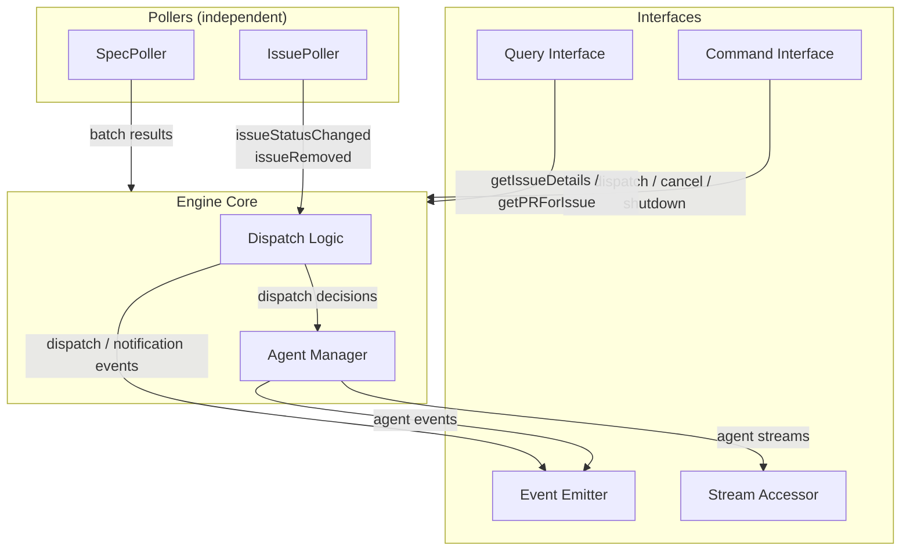

# Control Plane Engine

## Overview

The engine is the core module of the control plane. It orchestrates independent pollers that monitor GitHub for state changes, classifies detected changes into dispatch tiers, manages agent sessions, and handles recovery. The engine has no knowledge of the TUI — it exposes four interfaces (event emitter, command interface, query interface, and stream accessor) that the TUI (or any other consumer) can use.

## Constraints

- Must not import or reference the TUI module.
- Must not crash on transient errors (GitHub API failures, network errors). Log and retry next cycle.
- Must not dispatch more than one agent per task issue at a time.
- Must not auto-dispatch the Planner for specs without `status: approved` in frontmatter.
- Must reset `status:in-progress` issues to `status:pending` when no agent is running for them (startup recovery and crash recovery).
- Must use `@octokit/rest` with `@octokit/auth-app` as the authentication strategy for all GitHub API interactions. Octokit is an implementation detail of the GitHub Client adapter — all engine code interacts with the `GitHubClient` interface, never with Octokit directly. No type assertions (`as`) are permitted at the adapter boundary or anywhere `GitHubClient` is consumed.
- Must use `@anthropic-ai/claude-agent-sdk` (≥0.2.x) for all agent invocations via the v1 `query()` API.
- Must detect spec changes remotely (via GitHub API), not from the local filesystem.
- GitHub write operations are limited to recovery (status label resets). All other writes are performed by agents.

## Specification

### Architecture

The engine consists of three layers:



- **Pollers** — Independent units that each monitor a single data source on their own interval. Pollers are pure sensors — they detect state changes and report results. IssuePoller emits events directly; SpecPoller returns batched results to the Engine Core. They do not make dispatch decisions.
- **Engine Core** — Receives poller events, classifies them by dispatch tier, and manages agent sessions. Owns dispatch policy and agent lifecycle.
- **Interfaces** — Event emitter (outbound state changes), command interface (inbound user actions), query interface (on-demand data fetching), and stream accessor (live agent output). All consumed by the TUI.

Each poller maintains its own snapshot slice. A failure in one poller does not affect others.

### GitHub Client

The engine accesses GitHub through a `GitHubClient` interface — a narrow, explicitly-typed contract covering only the API methods the engine uses. The `createGitHubClient` factory constructs an Octokit instance internally and returns a thin adapter that satisfies `GitHubClient` without type assertions.

**Why a wrapper:** Octokit's deeply generic types do not structurally match a narrow interface, even when the methods are compatible at runtime. Casting (`as unknown as GitHubClient`) would hide real mismatches. Instead, each adapter method explicitly calls the corresponding Octokit method and returns the result through a properly-typed function signature. The wrappers are 1:1 delegations — no transformation, no error mapping, no retry logic. They exist solely to bridge the type gap.

**Factory:** `createGitHubClient(config: GitHubClientConfig): GitHubClient`

The factory:

1. Creates an `Octokit` instance with `createAppAuth` as the auth strategy, using the provided `appID`, `privateKey`, and `installationID`.
2. Returns an object satisfying `GitHubClient` where each method delegates to the corresponding Octokit method.

**Module location:** `engine/github-client/`. The module contains:

- `types.ts` — `GitHubClientConfig`, `GitHubClient`, and all param/result types.
- `create-github-client.ts` — The adapter factory. Imports `Octokit` from `@octokit/rest` and `createAppAuth` from `@octokit/auth-app`. This is the only file in the engine that imports from `@octokit/*`.

**Octokit isolation:** No file outside `engine/github-client/` may import from `@octokit/rest` or `@octokit/auth-app`. This ensures Octokit is a swappable implementation detail.

**Caller responsibility:** The caller reads the private key from disk and passes the PEM content as a string. The adapter does not perform filesystem I/O.

**Auth validation:** `@octokit/auth-app` validates credentials lazily — the first API call triggers JWT creation and token exchange, not the `createGitHubClient` call itself. If credentials are invalid (bad key, wrong app ID, etc.), the first poller cycle will fail. The engine's error handling (log and retry next cycle) applies, but since invalid credentials never self-heal, this will fail indefinitely. This is acceptable for v1 — invalid credentials are a deployment misconfiguration, caught immediately on first cycle. The operator must fix the config and restart.

### Pollers

#### IssuePoller

Monitors GitHub Issues for status label changes.

**Poll cycle:**

1. Query open issues with the `task:implement` label via `GitHubClient`. Only `task:implement` issues are tracked — `task:refinement` issues are outside the control plane's scope (they do not have status transitions that drive agent dispatch).
2. For each issue, compare the current `status:*` label against the snapshot.
3. For each change, emit `issueStatusChanged` with the issue number, old status, and new status.
4. Update the snapshot.

**Snapshot state:**

| Field | Description |
|-------|-------------|
| Issue number | GitHub Issue number |
| Title | Issue title |
| Status label | Current `status:*` label value |
| Priority label | Current `priority:*` label value |
| Creation date | ISO 8601 timestamp |

**Change detection:** Only `status:*` label changes trigger `issueStatusChanged` events. Title, priority, and creation date are included in the event payload for convenience (the IssuePoller already has this data from the API response) but changes to these fields alone do not trigger events. The snapshot tracks them so they can be included in future events.

**Closed issue detection:** On each poll cycle, the IssuePoller compares the set of issue numbers in the API response against the snapshot. Issues present in the snapshot but absent from the response have been closed or had their `task:implement` label removed. For each removed issue, the IssuePoller removes it from the snapshot and reports the removal to the Engine Core. The Engine Core then: (1) if an agent is running for the issue, cancels the agent session and emits `agentFailed` (treated as cancellation — worktree preserved if Implementor); then (2) emits `issueRemoved`. This ordering guarantees `agentFailed` is emitted before `issueRemoved` for the same issue, so the TUI can process the failure before the issue is removed from its store.

**Initial poll cycle:** On the first cycle, the snapshot is empty. All detected issues are treated as new — each emits an `issueStatusChanged` event with `oldStatus: null`. This is how the engine populates the initial issue set. The dispatch logic treats `oldStatus: null` the same as any other status change for tier classification.

**Startup burst:** This means the first poll cycle may trigger dispatch actions for all existing issues simultaneously: auto-dispatching Reviewers for all `status:review` issues, emitting `dispatchReady` for all `status:pending` issues, and emitting notifications for all `status:needs-refinement`/`status:blocked` issues. This is intentional — if the control plane starts (or restarts), it should bring the system to the correct state. Startup recovery completes before the first poll cycle, so `status:in-progress` issues will already be reset to `status:pending`.

**First-cycle execution:** `Engine.start()` runs the first poll cycle of each poller as a direct invocation, not via the interval timer. It awaits both first cycles before resolving. Interval-based polling begins after the first cycles complete. This ensures the TUI receives the initial issue set and any startup-triggered dispatch events before `start()` resolves.

#### SpecPoller

Monitors the specs directory on the default branch for changes, using the GitHub Trees API.

**Poll cycle:**

1. Fetch the tree SHA of the specs directory on the default branch via `GitHubClient`.
2. Compare the tree SHA against the snapshot.
3. If unchanged — notify the Engine Core with an empty batch (`changes: []`). No further API calls are made for this cycle.
4. If changed — fetch the full tree. Compare each entry's blob SHA against the snapshot's per-file entries to classify changes: entries absent from the snapshot are additions, entries with a different blob SHA are modifications, entries present in the snapshot but absent from the tree are removals.
5. For each added or modified file, fetch its content via `repos.getContent` (returns base64-encoded content), decode it, and parse the frontmatter `status` value.
6. Fetch the HEAD commit SHA of the default branch via `git.getRef` (for spec diff URLs in the TUI). Note: this is the current HEAD commit, not necessarily the specific commit that modified each spec file. If multiple commits were pushed between poll cycles, the diff URL shows the HEAD commit's full diff, not a per-file change view. This is a known limitation — acceptable because the notification identifies the changed file path, giving the user enough context to find the relevant changes.
7. Return the complete batch of changes to the Engine Core.
8. Update the snapshot.

The SpecPoller returns results synchronously to the Engine Core on every cycle, even when no changes are detected (empty `changes` array). This ensures the Engine Core can dispatch deferred Planner paths on any cycle (see Planner concurrency guard), not only when the SpecPoller detects changes. When `changes` is non-empty, the Engine Core emits individual `specChanged` events per file (for the TUI's notification history) and separately passes the full batch of approved spec paths to the dispatch logic for a single Planner invocation. The per-file events are not the input to Planner dispatch — the Engine Core passes the batch directly. This ensures reliable batching.

**Snapshot state:**

| Field | Description |
|-------|-------------|
| Tree SHA | SHA of the specs directory tree on the default branch |
| Per-file entries | Map of file path → blob SHA and frontmatter `status` value |

The tree SHA comparison makes the common case (nothing changed) a single API call. Detailed file inspection only happens when the tree SHA differs.

**Snapshot seeding:** The SpecPoller accepts an optional initial snapshot (tree SHA and per-file entries) via its constructor. When provided, the snapshot starts with the seeded state instead of empty. This enables the Planner Cache to prevent redundant Planner runs on engine restart — the SpecPoller compares blob SHAs against the seeded state and only reports files that actually changed. If no seed is provided, the snapshot starts empty (existing behavior). See Planner Cache.

**Snapshot access:** The SpecPoller exposes a `getSnapshot()` method that returns the current snapshot state (tree SHA and per-file entries) as a `SpecPollerSnapshot`. The Engine Core uses this at Planner dispatch time to capture the state for the Planner Cache.

**Removed specs:** If a spec file is deleted, the SpecPoller removes it from its per-file snapshot. No `specChanged` event is emitted for removals — existing task issues for the removed spec are unaffected. The Planner is not notified of removals.

### Dispatch Logic

The engine core listens to poller events and classifies each into a dispatch tier. Dispatch logic is centralized — pollers never dispatch agents.

#### Auto-dispatch

The engine invokes the agent automatically with no user action.

| Poller Event | Agent | Condition |
|-------------|-------|-----------|
| `specChanged` | Planner | Spec frontmatter `status` is `approved` |
| `issueStatusChanged` to `status:review` | Reviewer | No agent already running for this issue |

The Planner is invoked once per SpecPoller cycle with all changed (and approved) spec paths batched into a single invocation. The Engine Core receives the full batch from the SpecPoller synchronously and passes approved paths to a single Planner dispatch.

**Planner concurrency guard:** Only one Planner session may run at a time. If a SpecPoller cycle detects changes while a Planner is already running, the engine emits `agentSkipped` for the Planner and defers the batch. The Engine Core maintains a deferred paths buffer (a set of file paths, deduplicated) for this purpose. On each subsequent SpecPoller cycle, the Engine Core merges the deferred buffer with the new cycle's results (union, deduplicated). The approval filter (`status: approved`) is applied to the merged set at dispatch time — paths whose frontmatter status changed to non-approved since deferral are dropped. The deferred buffer is cleared when the Planner is successfully dispatched. If the Planner session fails, the Engine Core re-adds the dispatched spec paths to the deferred buffer so they are included in the next dispatch attempt rather than being lost until restart.

**Planner idempotency:** The engine does not prevent re-dispatch for the same spec (e.g., a whitespace-only change to an approved spec will re-trigger the Planner). The Planner agent definition is responsible for idempotency — checking existing issues before creating new ones. See `agent-planner.md`.

The Reviewer is invoked per issue — one Reviewer per issue that entered `status:review`.

#### User-dispatch

The engine emits a `dispatchReady` event surfacing the issue to the TUI. The user decides when (or whether) to dispatch.

| Poller Event | Agent |
|-------------|-------|
| `issueStatusChanged` to `status:pending` | Implementor |
| `issueStatusChanged` to `status:unblocked` | Implementor |
| `issueStatusChanged` to `status:needs-changes` | Implementor |

User-dispatch items are surfaced on first detection (status differs from snapshot). They are not re-surfaced on subsequent polls if the status has not changed again.

#### Notify-only

The engine emits a notification event. No agent is dispatched.

| Poller Event | Notification |
|-------------|-------------|
| `issueStatusChanged` to `status:needs-refinement` | Clipboard-ready CLI command for the Human to address the spec issue. Includes resolution guidance: "After amending the spec, change the label to `status:unblocked`." `contextURL`: issue URL. |
| `issueStatusChanged` to `status:blocked` | Notification with issue URL for the Human to investigate the blocker. Includes resolution guidance: "After resolving the blocker, change the label to `status:unblocked`." `contextURL`: issue URL. |
| `issueStatusChanged` to `status:approved` | Notification that the issue is ready for Human to merge. `contextURL`: issue URL. The TUI is responsible for asynchronous PR URL lookup (see `control-plane-tui.md`). |

**Clipboard command format** for `status:needs-refinement`:

```
claude -p "Use /spec-writing to address the spec refinement needed for issue #<N>. See blocker comment: https://github.com/<owner>/<repo>/issues/<N>"
```

This gives the Human a ready-to-paste command to kick off a spec amendment workflow outside the control plane. The `/spec-writing` skill handles the structured spec authoring process.

Notifications are dismissed automatically when the underlying issue's status changes to a different value on a subsequent poll.

**Event ordering:** For each status change, the Engine Core emits `issueStatusChanged` before any dispatch-tier event (`dispatchReady`, `notification`, or auto-dispatch trigger). This ensures the TUI's store has the updated issue state before processing dispatch events that reference it.

**Dispatch fallthrough:** Status changes to values not listed in any dispatch tier (e.g., `in-progress`) trigger no dispatch action. The `issueStatusChanged` event is still emitted so the TUI can update the issue's state indicator.

### Event Emitter

The engine emits typed events for discrete state changes. Events drive reactive updates in the TUI's Zustand store. Streaming agent output is handled separately via the stream accessor (see below).

| Event | Payload | Emitted By |
|-------|---------|-----------|
| `issueStatusChanged` | Issue number, title, old status, new status, priority label, creation date, `isRecovery` flag (true for synthetic events from recovery) | IssuePoller (or Engine Core for synthetic recovery events) |
| `specChanged` | File path, frontmatter status, change type (added/modified), commit SHA | Engine Core (from SpecPoller results) |
| `agentStarted` | Agent type, issue number or spec paths, session ID | Agent Manager |
| `agentCompleted` | Agent type, issue number or spec paths, session ID, log file path (when logging enabled) | Agent Manager |
| `agentFailed` | Agent type, issue number or spec paths, error details, session ID, worktree path (Implementor only), log file path (when logging enabled) | Agent Manager |
| `agentSkipped` | Agent type, issue number or spec paths (deferred) | Agent Manager (per-issue guard) or Engine Core (Planner concurrency guard) |
| `dispatchReady` | Issue number, status label | Dispatch Logic |
| `notification` | Issue number, status label, `contextURL` (issue URL), `clipboardCommand` (optional — present for `needs-refinement`, absent for `blocked` and `approved`), `resolutionGuidance` (optional — present for `needs-refinement` and `blocked`, absent for `approved`). Note: this is a specific engine event type for notify-only tier issues, distinct from the TUI's "notification" concept (the TUI surfaces all engine events as notification entries in the notifications pane). | Dispatch Logic |
| `notificationDismissed` | Issue number | Dispatch Logic |
| `issueRemoved` | Issue number | IssuePoller |
| `recoveryPerformed` | Issue number, old status, new status | Engine Core (startup recovery) or Agent Manager (crash recovery) |

### Command Interface

The engine accepts commands that trigger side effects.

| Command | Parameters | Effect |
|---------|-----------|--------|
| `dispatchImplementor` | Issue number | Creates an Implementor agent session for the given issue (if no agent is already running for it). No-op if the issue number is not in the IssuePoller snapshot or if the issue's status is not in the user-dispatch set (`pending`, `unblocked`, `needs-changes`). |
| `dispatchReviewer` | Issue number | Creates a Reviewer agent session for the given issue (if no agent is already running for it). No-op if the issue number is not in the IssuePoller snapshot or if the issue's status is not `review`. Used for manual retry after Reviewer failure. |
| `cancelAgent` | Issue number | Cancels the running agent session for the given issue. The engine determines agent-specific behavior (recovery, worktree handling) from its internal tracking of which agent type is running. For Implementors: performs crash recovery if the issue is still `status:in-progress`, preserves the worktree. For Reviewers: no recovery needed (issue stays `status:review`; user can retry via `dispatchReviewer`). Emits `agentFailed` with a cancellation error. No-op if no agent is running. |
| `cancelPlanner` | None | Cancels the running Planner session if one exists. Emits `agentFailed` with a cancellation error. No-op if no Planner is running. |
| `shutdown` | None | Initiates graceful shutdown |

### Query Interface

The engine provides on-demand data fetching for display purposes. Queries are read-only and fetch data via `GitHubClient` when called. Results are not cached by the engine — the TUI manages its own caching in the Zustand store.

| Query | Parameters | Returns |
|-------|-----------|---------|
| `getIssueDetails` | Issue number | Issue body (objective, spec reference, scope, acceptance criteria), labels, creation date |
| `getPRForIssue` | Issue number | PR number, title, changed files count, CI status, URL. Returns `null` if no linked PR exists. |

PR linkage is determined by searching for a PR whose body contains a closing keyword referencing the issue number. The match is case-insensitive and supports GitHub's closing keywords: `Closes`, `Fixes`, `Resolves` (and their conjugations: `Close`, `Closed`, `Fix`, `Fixed`, `Resolve`, `Resolved`). The issue number must be followed by whitespace, punctuation, or end of line — not additional digits (word-boundary match). If multiple open PRs match, the first match (by PR number, ascending) is used. Branch name matching is not used because the Implementor renames the working branch (`issue-<N>`) to the convention format (`<type>/<N>-<description>`) before pushing.

**Pagination:** `getIssueDetails` fetches the issue directly via `issues.get` (no pagination concern). `getPRForIssue` lists open PRs via `pulls.list` with `per_page: 100` without pagination. The IssuePoller's `issues.listForRepo` call also uses `per_page: 100` without pagination. Repositories with more than 100 open task issues or 100 open PRs will have results silently truncated. This is a known v1 limitation — acceptable for the expected scale of managed repositories.

**Query normalization:** The `GitHubClient` param/result types mirror Octokit's response shapes (e.g., `IssueData.body` is `string | null`, `IssueData.labels` is `(string | { name?: string })[]`). The query functions normalize these into the cleaner result types consumed by the TUI:

- `getIssueDetails` — Coerces `body` from `string | null` to `string` (empty string for `null`). Extracts label names from the `labels` array: for each entry, uses the string directly if it is a bare string, or extracts the `name` property if it is an object with a `name` string. Entries that are objects without a `name` property are discarded.
- `getPRForIssue` — Lists open PRs (`per_page: 100`), finds the one whose body matches a closing keyword for `#<N>`, then fetches the full PR via `pulls.get` to obtain `head.sha`. Uses `head.sha` to query CI status via `repos.getCombinedStatusForRef` and `checks.listForRef`. Combines both into the `ciStatus` field using the following logic:
  - `'failure'` — if `getCombinedStatusForRef` reports `state: 'failure'`, or any check run has `conclusion` of `'failure'`, `'cancelled'`, or `'timed_out'`.
  - `'pending'` — if any check run has `status` other than `'completed'` (i.e., `'queued'` or `'in_progress'`), or if `getCombinedStatusForRef` reports `state: 'pending'`, or if both endpoints report `total_count: 0` (no CI configured).
  - `'success'` — if `getCombinedStatusForRef` reports `state: 'success'` (or `total_count: 0`) and all check runs have `status: 'completed'` with `conclusion: 'success'`.

### Stream Accessor

The engine exposes live agent output streams, separate from the event emitter. Streaming output is high-frequency data that should not flow through the discrete event channel.

| Method | Parameters | Returns |
|--------|-----------|---------|
| `getAgentStream` | Issue number | An `AsyncIterable<string>` of plain text output chunks for the running agent session, or `null` if no agent is running for this issue. |

Each chunk is a plain text string extracted from the SDK session's message stream. The engine subscribes to the SDK session internally, extracts text content from assistant messages, and re-yields it as plain strings. Binary data, tool use metadata, and system messages are not surfaced — only human-readable text output.

The TUI subscribes to agent streams directly for rendering in the detail pane. The stream ends when the agent session completes (success, failure, or cancellation). Cancelling an agent session via `cancelAgent` causes the stream's async iterable to complete. The Agent Manager subscribes to the SDK session's output internally and exposes it through this method.

Planner streams are not exposed through this interface. The Planner operates on specs (not task issues), and `getAgentStream` is keyed by issue number. Planner activity is visible only through notification events (`agentStarted`, `agentCompleted`, `agentFailed`). This is intentional — Planner output (issue creation/updates) is observable via the IssuePoller.

### Agent Lifecycle

When the engine dispatches an agent:

1. **Guard** — Check if an agent is already running for this issue. If so, emit `agentSkipped` and return.
2. **Worktree** (Implementor only) — Create or reuse a worktree at `.worktrees/issue-<N>` on branch `issue-<N>`. See `control-plane.md` Worktree Isolation.
3. **Create session** — Create an agent session via `query()` from `@anthropic-ai/claude-agent-sdk`. The engine loads the agent definition inline (see Agent Definition Loading) and passes it to the SDK via the `agents` option. See SDK Session Configuration below for the full call signature.
4. **Capture session ID** — The SDK returns a `session_id` in its init message. Store this alongside the session handle.
5. **Track** — Record the agent session as running for this issue/spec, including the session handle, session ID, and worktree path (if Implementor).
6. **Emit** — Emit `agentStarted` with the session ID.
7. **Start duration timer** — Begin a timer for `maxAgentDuration` seconds. If the timer fires before the session completes, cancel the session (treated as failure).
8. **Monitor** — Non-blocking. When the session completes:
   - Remove from active tracking.
   - If session succeeded: emit `agentCompleted`. If Implementor, remove the worktree.
   - If session failed: emit `agentFailed` with session ID and worktree path (Implementor only). If Implementor, preserve the worktree for inspection.
   - **Crash recovery (Implementor only):** If the issue is still `status:in-progress`, reset to `status:pending`, emit `recoveryPerformed` and a synthetic `issueStatusChanged`. See Recovery section.
   - **Planner sessions** skip crash recovery entirely (no associated issue).
   - **Reviewer sessions** skip crash recovery (issue stays `status:review`; see Reviewer failure note in Recovery section).

**Session resume:** The SDK supports resuming a failed session via `resume: sessionId`. The engine does not resume sessions automatically — it always starts fresh sessions. However, the session ID from a failed run is included in the `agentFailed` event so the TUI can surface it to the user for manual resume outside the control plane if needed.

Each agent session receives trigger-specific context as its initial prompt:

| Agent | Trigger Context |
|-------|----------------|
| Planner | Changed spec file paths (space-separated) |
| Implementor | Issue number |
| Reviewer | Issue number |

### Agent Definition Loading

The engine reads agent definition files from `.claude/agents/<name>.md` at the repository root and passes them inline to the SDK. This is required because the SDK's `settingSources: ['project']` resolution hangs indefinitely when `cwd` is a git worktree — worktrees use a `.git` file (pointer to the main repository's `.git` directory) instead of a `.git` directory, and the SDK's project settings resolution does not handle this case.

**Loading process:**

1. The `QueryFactory` receives `repoRoot` at construction time.
2. When creating a session, it reads `{repoRoot}/.claude/agents/{agentName}.md` from disk.
3. It parses the file's YAML frontmatter using `gray-matter`, extracting: `description`, `tools` (comma-separated string → `string[]`), `model`, and any other frontmatter fields.
4. The markdown body (after frontmatter) becomes the agent's `prompt` (system prompt).
5. It constructs an `AgentDefinition` object (SDK type) and passes it via the `agents` option in the `query()` call.

**Frontmatter field mapping:**

| Agent file frontmatter | `AgentDefinition` field | Transform |
|------------------------|------------------------|-----------|
| `description` | `description` | Direct string copy |
| `tools` | `tools` | Split comma-separated string, trim whitespace → `string[]`. The agent files use YAML bare string format (`tools: Read, Grep, Glob, Bash`), which `gray-matter` parses as a single string. If the field is already an array (YAML list syntax), use it directly. |
| `model` | `model` | Direct string copy (e.g., `'opus'`). Defaults to `'inherit'` if absent. |
| (markdown body) | `prompt` | Direct string copy |

**Fields not mapped to `AgentDefinition`:** The agent file frontmatter includes fields like `name`, `skills`, `hooks`, and `permissionMode` that are not part of the SDK's `AgentDefinition` type. These are handled as follows:

- **`hooks`** — Passed programmatically via the SDK's `hooks` option (session-level, not agent-level). The engine provides a TypeScript implementation of the bash validator hook. See Programmatic Hooks below.
- **`skills`** — Discovered by `settingSources: ['project']` from `.claude/skills/` in the project tree. No special handling needed.
- **`permissionMode`** — Overridden by the engine's explicit `permissionMode` option regardless.

**Error handling:** If the agent definition file cannot be read (missing, permissions error) or contains malformed YAML (frontmatter parsing failure), the error propagates to the caller — the session is not created. This is treated as an agent session creation failure (log at `error` level, retry next cycle).

**Module location:** The agent definition loading logic lives in `engine/agent-manager/`. The `buildQueryFactory` function accepts `repoRoot` and performs the file reading and frontmatter parsing internally.

### Programmatic Hooks

The engine passes hooks to the SDK programmatically via the `hooks` option in `query()`, rather than relying on hook definitions in agent files or `.claude/settings.json`. This is necessary because agent-file-level hooks are part of agent definition resolution, which the engine bypasses by providing definitions inline (see Agent Definition Loading).

**Bash validator hook:** All workflow agents run with `permissionMode: 'bypassPermissions'`, which removes all interactive guardrails on the Bash tool. The engine registers a `PreToolUse` hook (matcher: `Bash`) that validates every Bash command against a blocklist/allowlist filter before execution. The validation rules (blocklist patterns, allowlist prefixes, command segmentation, evaluation order) are defined in `agent-hook-bash-validator.md`. The engine provides a TypeScript implementation of those rules; the shell script implementation (`agent-hook-bash-validator-script.md`) serves interactive agent use outside the control plane. Both implementations produce identical accept/reject decisions.

**Hook implementation:**

The `QueryFactory` receives a `PreToolUse` hook callback at construction time and includes it in the `hooks` option of every `query()` call. The callback:

1. Extracts the `command` string from the hook input's `tool_input`.
2. Runs the command through the blocklist (same ERE patterns as the shell script, evaluated via RegExp).
3. If no blocklist match, segments the command (quote-aware splitting on `&&`, `||`, `;`, `|`, newlines) and checks each segment's first word against the allowlist.
4. Returns `{ decision: 'approve' }` to allow, or `{ decision: 'block', reason: '<message>' }` to reject. The `reason` string must use the exact error message format defined in `agent-hook-bash-validator.md` § Error Message Format (`Blocked: matches dangerous pattern '<pattern>'` for blocklist, `Blocked: '<command>' is not in the allowed command list` for allowlist).

The hook callback signature follows the SDK's `HookCallback` type:

```ts
type HookCallback = (
  input: HookInput,
  toolUseID: string | undefined,
  options: { signal: AbortSignal },
) => Promise<HookJSONOutput>;
```

**Module location:** The bash validator TypeScript implementation lives in `engine/agent-manager/`. It implements the validation rules from `agent-hook-bash-validator.md` — blocklist patterns, allowlist prefixes, command segmentation, quote-aware parsing, and evaluation order. See that spec for the normative rule definitions.

### SDK Session Configuration

The Agent Manager creates agent sessions using the v1 `query()` function from `@anthropic-ai/claude-agent-sdk`. The engine loads agent definitions inline (see Agent Definition Loading above) and passes them via the `agents` option, while `settingSources: ['project']` loads project-level settings (CLAUDE.md, `.claude/settings.json`, skills, hooks). The engine controls session-level options (working directory, permissions, cancellation) directly.

**Call signature:**

```ts
import { query } from '@anthropic-ai/claude-agent-sdk';

const q = query({
  prompt: triggerContext,     // e.g., 'docs/specs/workflow/control-plane.md' or '42'
  options: {
    agent: agentName,         // e.g., 'planner', 'implementor', 'reviewer'
    agents: {
      [agentName]: agentDefinition, // inline AgentDefinition loaded from .claude/agents/<name>.md
    },
    cwd: workingDirectory,    // worktree path (Implementor) or repo root (Planner, Reviewer)
    settingSources: ['project'],
    hooks: {
      PreToolUse: [{ matcher: 'Bash', hooks: [bashValidatorHook] }],
    },
    permissionMode: 'bypassPermissions',
    allowDangerouslySkipPermissions: true,
    abortController,
  },
});
```

**Option details:**

| Option | Value | Purpose |
|--------|-------|---------|
| `prompt` | Trigger context string | The initial user message. Space-separated spec paths (Planner), or issue number as string (Implementor, Reviewer). |
| `agent` | Agent name from config | Selects which agent definition to use from the `agents` map. |
| `agents` | `Record<string, AgentDefinition>` | Inline agent definitions loaded by the engine from `.claude/agents/<name>.md`. The SDK uses this map instead of resolving agent files from the filesystem via `settingSources`. |
| `cwd` | Worktree or repo root | Implementor: `.worktrees/issue-<N>`. Planner, Reviewer: repository root. |
| `settingSources` | `['project']` | Loads project-level settings: `.claude/settings.json`, CLAUDE.md project instructions, and skills from `.claude/skills/`. Does **not** need to resolve agent definition files because `agents` provides them inline. |
| `hooks` | `{ PreToolUse: [{ matcher: 'Bash', hooks: [bashValidatorHook] }] }` | Programmatic hooks. The bash validator hook validates every Bash command against a blocklist/allowlist before execution. See Programmatic Hooks. |
| `permissionMode` | `'bypassPermissions'` | Agents run non-interactively. All tool invocations are auto-approved. |
| `allowDangerouslySkipPermissions` | `true` | Required safety acknowledgment when using `bypassPermissions` (SDK ≥0.2.x). |
| `abortController` | `AbortController` | Cancellation handle. The engine calls `abortController.abort()` for user cancellation, shutdown, and duration timeout. |

**Why inline loading:** The SDK's `settingSources: ['project']` resolution discovers `.claude/agents/` by traversing the filesystem from `cwd` upward looking for a `.git` directory. Git worktrees have a `.git` file (not a directory), causing the resolution to fail silently — the CLI subprocess hangs indefinitely with zero output. By loading agent definitions inline, the engine reads from the repository root (which always has a `.git` directory) and passes the definitions directly to the SDK, bypassing the worktree resolution issue entirely. This applies to all agent types (Implementor, Planner, Reviewer) for consistency, even though only the Implementor currently runs in a worktree.

**SDK `AgentDefinition` type:**

```ts
type AgentDefinition = {
  description: string;
  tools?: string[];
  disallowedTools?: string[];
  prompt: string;
  model?: 'sonnet' | 'opus' | 'haiku' | 'inherit';
  mcpServers?: AgentMcpServerSpec[];
};
```

**SDK isolation:** No file outside `engine/agent-manager/` may import from `@anthropic-ai/claude-agent-sdk`. The `QueryFactory` dependency injection seam (see below) ensures the SDK is mockable for testing.

**QueryFactory:** The Agent Manager does not call `query()` directly. It receives a `QueryFactory` function as a dependency, enabling test doubles that simulate the SDK's async message stream without spawning real agent processes.

### Agent Session Logging

When `logging.agentSessions` is enabled, the Agent Manager writes a human-readable transcript of each agent session to disk. Logs capture the full SDK message stream — session metadata, assistant text, tool invocations, result summaries, and unrecognized message types.

**File lifecycle:**

1. When a session starts (SDK `init` message received), create the log file at `{logsDir}/{timestamp}-{agentType}[-{context}].log` where:
   - `timestamp` is `Date.now()` (milliseconds since epoch)
   - `agentType` is `planner`, `implementor`, or `reviewer`
   - `[-{context}]` is `-{issueNumber}` for Implementor/Reviewer, omitted entirely (including the dash) for Planner
   - Examples: `1738934400000-implementor-42.log`, `1738934400000-planner.log`
2. Write the session header immediately.
3. As each SDK message arrives, format and append it to the file.
4. When the session ends (success, failure, or cancellation), write a footer with the outcome, then close the file. The footer must be written before the terminal event (`agentCompleted` / `agentFailed`) is emitted, so that `logFilePath` points to a complete file. The `Outcome` line uses one of three values: `completed` (SDK reports success), `failed` (SDK reports error or session throws), or `cancelled` (user cancellation, shutdown, or timeout). Cancellation flows through `agentFailed` at the event level, but the log footer preserves the distinction.

**Log file format:**

```
=== Agent Session ===
Type:       planner
Session ID: abc-123
Spec Paths: docs/specs/workflow/control-plane-tui.md
Started:    2026-02-08T19:21:39.000Z

=== Messages ===

[19:21:39] SYSTEM init
  Model: claude-opus-4-6
  CWD: /home/geoff/projects/sear
  Tools: Read, Write, Edit, Bash, Glob, Grep

[19:21:40] ASSISTANT
  Let me read the spec file to understand the changes.

[19:21:40] ASSISTANT
  [tool_use] Read

[19:21:42] ASSISTANT
  I've read the spec. Let me create the task issues...

[19:21:50] RESULT success
  Duration: 11.0s
  Cost:     $0.15
  Turns:    5
  Tokens:   5000 in / 2000 out

=== Session End ===
Outcome:  completed
Finished: 2026-02-08T19:21:50.000Z
```

**Context-specific header fields:**

| Agent | Header field |
|-------|-------------|
| Planner | `Spec Paths: {comma-separated paths}` |
| Implementor | `Issue: #{issueNumber}` |
| Reviewer | `Issue: #{issueNumber}` |

**Message formatting by type:**

All `[HH:MM:SS]` timestamps are UTC. Each SDK `assistant` message may contain multiple content blocks (text and tool_use mixed). The Agent Manager writes one `[HH:MM:SS] ASSISTANT` line per content block, not per SDK message.

| SDK Message Type | Format |
|------------------|--------|
| `system` + `init` | `[HH:MM:SS] SYSTEM init` followed by model, CWD, available tools |
| `assistant` (text block) | `[HH:MM:SS] ASSISTANT` followed by text content, indented (2 spaces) |
| `assistant` (tool_use block) | `[HH:MM:SS] ASSISTANT` followed by `[tool_use] {toolName}` (name only, no input/output) |
| `result` | `[HH:MM:SS] RESULT {subtype}` followed by available session metadata (duration, cost, turns, token counts — logged if present in the SDK result message) |
| All other types | `[HH:MM:SS] UNKNOWN {type}` followed by raw JSON of the message. This intentionally includes SDK message types like `user` and `tool_result` — they receive the generic treatment rather than dedicated formatting. |

**Error handling:** Log writing failures are non-fatal. If the `logsDir` directory cannot be created or the log file cannot be opened, the Agent Manager skips logging for the remainder of that session — no `logFilePath` is included in the terminal event. If a write fails mid-session (e.g., disk full), the Agent Manager disables logging for the remainder of that session and logs a warning via the structured logger. The `logFilePath` field is still included in the terminal event, pointing to the partial file — a partial transcript is more useful than no transcript. In all cases, agent session behavior is unaffected.

**Log file path in events:** When agent session logging is enabled, `AgentCompletedEvent` and `AgentFailedEvent` include a `logFilePath` field with the absolute path to the session log file. The field is absent when: logging is disabled, the log file could not be created, or the session ended before the SDK `init` message was received (no file was opened).

### Recovery

#### Startup Recovery

On initialization, before pollers start:

1. Query all open issues with `task:implement` label via `GitHubClient`.
2. For each issue with `status:in-progress`, check if an agent session is tracked for it.
3. Since no agents are tracked at startup, all `status:in-progress` issues are stale.
4. Reset each to `status:pending` via `GitHubClient`.
5. Emit `recoveryPerformed` for each.
6. Emit a synthetic `issueStatusChanged` for each (oldStatus: `in-progress`, newStatus: `pending`, `isRecovery: true`), populated from the GitHub API response (title, priority label, creation date). Synthetic events pass through the dispatch logic like any other `issueStatusChanged` — so recovered issues with `newStatus: 'pending'` will emit `dispatchReady`. This ensures the TUI store populates recovered issues immediately and surfaces them as ready for dispatch.

#### Crash Recovery

After any agent session completes (success or failure):

1. Check if the issue still has `status:in-progress`.
2. If yes, reset to `status:pending` via `GitHubClient`.
3. Emit `recoveryPerformed`.
4. Emit a synthetic `issueStatusChanged` (oldStatus: `in-progress`, newStatus: `pending`, `isRecovery: true`) so the TUI store updates immediately rather than waiting for the next poll cycle. Populate all standard fields (title, priority label, creation date) from the IssuePoller snapshot. Synthetic events pass through the dispatch logic, so this will also emit `dispatchReady`. The `isRecovery` flag tells the TUI store to update the status label without clearing `lastFailure` (the failure overlay must survive recovery). Update the IssuePoller snapshot to match.

This ensures no issue is permanently stuck in `status:in-progress` due to agent failure or an agent that succeeds without updating the label.

**Note on transition table:** The `in-progress → pending` reset is an administrative override that bypasses the normal transition table defined in `workflow.md`. It is the only engine-initiated status change besides startup recovery.

**Reviewer failure:** Crash recovery only applies to `status:in-progress`. When a Reviewer fails, the issue remains `status:review` (Reviewers do not change the status to `in-progress`). No recovery is performed — the issue stays in `status:review` with no running agent. The TUI surfaces the failure via `lastFailure`, and the user can retry via the `dispatchReviewer` command. The IssuePoller will not re-trigger auto-dispatch because the status hasn't changed since the last poll.

### Planner Cache

The engine persists a lightweight cache to prevent redundant Planner runs across restarts. Without this cache, the SpecPoller starts with an empty snapshot on each engine initialization, causing all approved specs to appear as new changes and triggering a full Planner dispatch.

**Cache file:** `.agentic-workflow-cache.json` at `repoRoot` (see Repository Root Resolution). This file should be gitignored — it is machine-local ephemeral state, not shared across clones.

**Format:**

```json
{
  "specsDirTreeSHA": "abc123def456...",
  "files": {
    "docs/specs/workflow/control-plane.md": {
      "blobSHA": "def456...",
      "frontmatterStatus": "approved"
    },
    "docs/specs/auth.md": {
      "blobSHA": "ghi789...",
      "frontmatterStatus": "draft"
    }
  }
}
```

The cache stores the SpecPoller's snapshot at the time the Planner was last successfully dispatched: the specs directory tree SHA and per-file blob SHAs with frontmatter status. The on-disk format is a JSON serialization of `SpecPollerSnapshot`.

**Startup seeding:** On engine initialization, before startup recovery:

1. Attempt to read `.agentic-workflow-cache.json` from `repoRoot`.
2. If the file exists and contains valid JSON matching the `SpecPollerSnapshot` schema, pass it to the SpecPoller as the initial snapshot seed.
3. The SpecPoller uses the seed as its starting snapshot, so the first poll cycle compares the current tree SHA and per-file blob SHAs against the seeded state. Only files that actually changed since the last successful Planner run are reported.
4. If the file is missing, unreadable, or contains invalid JSON, treat as a cold start — the SpecPoller starts with an empty snapshot (existing behavior). Log at `debug` level (a missing cache is normal on first run).

The startup sequence becomes: load planner cache → startup recovery → start pollers.

**Cache write:** When the Engine Core dispatches the Planner, it calls `getSnapshot()` on the SpecPoller and stores the result. When the Planner session completes successfully (`agentCompleted`), the Engine Core writes the stored snapshot to the cache file. The snapshot is captured at dispatch time, not at completion time — this ensures changes detected by the SpecPoller during the Planner's run (which go to the deferred buffer) are not incorrectly marked as planned.

**Behavior by scenario:**

| Scenario | Behavior |
|----------|----------|
| Restart, no spec changes | Tree SHA matches cache → SpecPoller reports no changes → Planner not dispatched |
| Restart, some specs changed | Tree SHA differs → SpecPoller compares blob SHAs → only changed files reported → Planner dispatched for changed approved specs only |
| Restart, one spec changed | Same as above — only the one changed file is reported and planned |
| First-ever run (no cache file) | Cold start → existing behavior |
| Cache file corrupt/unreadable | Treated as cold start |
| Planner fails | Cache not updated → next restart uses previous cache → changes re-detected and re-planned |

**Deferred paths interaction:** If the Planner succeeds but changes were deferred during its run, the cached snapshot reflects the state at dispatch time (before the deferred changes were detected). On the next restart, the SpecPoller compares the current tree against the cached snapshot. Files that changed after the cached snapshot (including the deferred changes) have different blob SHAs and are detected and planned.

**Cache write errors:** If the cache file cannot be written (permissions, disk full), log at `error` level and continue. The engine operates correctly without the cache — the next restart will perform a full Planner run. This is non-fatal.

### Repository Root Resolution

The engine must resolve the git repository root at startup. This path is used for:

- Worktree creation (`.worktrees/issue-<N>` is relative to repo root)
- Agent definition loading (`.claude/agents/<name>.md` is read from repo root)
- Planner cache file location (`.agentic-workflow-cache.json` at repo root)
- Relative `logsDir` resolution

**Resolution:** The `createEngine` factory resolves the repository root using `git rev-parse --show-toplevel` (via `execFileSync`). This is a synchronous call that runs once at engine construction time.

**Why not `process.cwd()`:** In a Yarn workspace, `process.cwd()` resolves to the package directory (e.g., `agentic-workflow/`), not the repository root. Using it would create worktrees inside the package directory and fail to find `.claude/agents/` for agent definition loading.

**Override:** The `createEngine` factory accepts an optional `repoRoot` dependency injection for testing. When not provided, it uses `git rev-parse --show-toplevel`.

### Configuration

The engine reads configuration from a TypeScript config file (`agentic-workflow.config.ts`):

#### Engine

| Setting | Type | Description | Default |
|---------|------|-------------|---------|
| `repository` | `string` | GitHub repository in `owner/repo` format | Required |
| `githubAppID` | `number` | GitHub App numeric ID | Required |
| `githubAppPrivateKeyPath` | `string` | Path to the PEM private key file | Required |
| `githubAppInstallationID` | `number` | Installation ID for the target repository | Required |
| `logLevel` | `string` | Logging verbosity (`debug`, `info`, `error`) | `info` |
| `shutdownTimeout` | `number` | Seconds to wait for agents during shutdown | `300` |

At startup, the engine parses `repository` into `owner` and `repo` strings (split on `/`). It reads the private key file from `githubAppPrivateKeyPath` and passes the PEM content string to `createGitHubClient` along with `githubAppID` and `githubAppInstallationID`. The returned `GitHubClient` instance, along with `owner` and `repo`, is then passed to all pollers, queries, and recovery as dependencies. Authentication is handled internally by `@octokit/auth-app` (JWT creation, installation token exchange, automatic token refresh) — no manual token management is needed. The App must have `issues:write` (for recovery label resets) and `contents:read` (for tree/file access) permissions.

#### IssuePoller

| Setting | Type | Description | Default |
|---------|------|-------------|---------|
| `pollInterval` | `number` | Seconds between poll cycles | `30` |

#### SpecPoller

| Setting | Type | Description | Default |
|---------|------|-------------|---------|
| `pollInterval` | `number` | Seconds between poll cycles | `60` |
| `specsDir` | `string` | Path to the specs directory (relative to repo root) | `docs/specs/` |
| `defaultBranch` | `string` | Branch to monitor for spec changes | `main` |

#### Agents

| Setting | Type | Description | Default |
|---------|------|-------------|---------|
| `agentPlanner` | `string` | Agent name for the Planner. The engine reads `.claude/agents/<name>.md` from the repository root, parses it, and passes the definition inline to the SDK. | `'planner'` |
| `agentImplementor` | `string` | Agent name for the Implementor. The engine reads `.claude/agents/<name>.md` from the repository root, parses it, and passes the definition inline to the SDK. | `'implementor'` |
| `agentReviewer` | `string` | Agent name for the Reviewer. The engine reads `.claude/agents/<name>.md` from the repository root, parses it, and passes the definition inline to the SDK. | `'reviewer'` |
| `maxAgentDuration` | `number` | Maximum seconds an agent session can run before being cancelled. Applies to all agent types. When exceeded, the engine cancels the session and performs crash recovery. | `1800` (30 min) |

#### Logging

| Setting | Type | Description | Default |
|---------|------|-------------|---------|
| `agentSessions` | `boolean` | Enable writing agent session transcripts to disk. When enabled, the Agent Manager writes one log file per agent session capturing the full SDK message stream. | `false` |
| `logsDir` | `string` | Directory for agent session log files. Absolute paths are used as-is. Relative paths are resolved from `repoRoot` (see Repository Root Resolution). Created automatically if it does not exist. | `logs` |

When `agentSessions` is `false` (default), no log files are created and agent events do not include `logFilePath`. The `logsDir` setting is ignored when `agentSessions` is disabled.

### Logging

The engine logs structured events at the following levels:

| Event | Level | Content |
|-------|-------|---------|
| Startup | `info` | Configuration summary, initial state counts |
| Poller cycle start | `debug` | Poller name, cycle number |
| Change detected | `info` | Poller name, change type, issue number or file path |
| Agent invoked | `info` | Agent type, issue number or file path, session ID |
| Agent skipped (already running) | `info` | Agent type, issue number |
| Agent completed | `info` | Agent type, issue number |
| Agent failed | `error` | Agent type, issue number, error details |
| No changes detected | `debug` | Poller name, cycle number |
| GitHub API error | `error` | Poller name, error details |
| Recovery performed | `info` | Issue number, old status, new status |
| Shutdown initiated | `info` | Reason |
| Shutdown complete | `info` | Agents terminated count |
| Planner cache loaded | `debug` | Loaded tree SHA and file count, or "cache miss — cold start" |
| Planner cache write failed | `error` | Error details |
| Agent session transcript | (file) | Full SDK message stream written to `{logsDir}/{timestamp}-{agentType}[-{context}].log`. One file per session. Only when `logging.agentSessions` is enabled. |

Entries with level `(file)` represent disk writes handled by the Agent Manager, not the structured logger. See Agent Session Logging for format details.

### Error Handling

The engine must not crash on transient errors. Each error type has a defined recovery behavior:

| Error | Behavior |
|-------|----------|
| GitHub API error (in any poller) | Log at `error` level. Skip this cycle for the affected poller only. Other pollers continue unaffected. Retry next cycle. |
| GitHub API rate limit (HTTP 403/429) | Treated as a GitHub API error — same log-and-skip behavior. The poll interval provides natural backoff. No explicit rate limit tracking or adaptive throttling in v1. GitHub App installation tokens have a 5,000 request/hour limit; with default poll intervals (30s issues, 60s specs), steady-state usage is well within this budget. |
| Agent definition file missing, unreadable, or malformed YAML | Treated as agent session creation failure — the error propagates before the session is created. Logged at `error` level. Not a transient error (requires fixing the agent file), but the engine continues operating. |
| Repository root resolution failure (`git rev-parse` fails) | Log at `error` level and exit. The engine cannot operate without a valid repository root. This is a deployment misconfiguration (not running inside a git repository). |
| Agent session creation failure | Log at `error` level. Do not mark agent as running. Next cycle will re-detect the state and retry dispatch. |
| Agent session failure | Log at `error` level with error details. Perform crash recovery if applicable. |
| Config file missing or invalid | Log at `error` level and exit. This is not a transient error. |
| Planner cache read error | Log at `debug` level. Treat as cold start — SpecPoller starts with empty snapshot. Non-fatal. |
| Planner cache write error | Log at `error` level. Engine continues — next restart cannot skip Planner. Non-fatal. |

### Graceful Shutdown

When a shutdown command is received:

1. Log shutdown initiation.
2. Stop all pollers (no new cycles).
3. Wait for all running agent sessions to complete, up to `shutdownTimeout` seconds.
4. If timeout is reached, cancel remaining agent sessions (using `cancelAgent` for task agents and `cancelPlanner` for the Planner internally).
5. Log shutdown completion and exit.

### Type Definitions

Reference types for the engine's public interfaces. These define the contracts that the TUI (or any consumer) relies on.

#### GitHub Client

```ts
type GitHubClientConfig = {
  appID: number;
  privateKey: string; // PEM file content (caller reads from disk)
  installationID: number;
};

// createGitHubClient(config: GitHubClientConfig): GitHubClient

type GitHubClient = {
  issues: {
    get(params: IssuesGetParams): Promise<IssuesGetResult>;
    listForRepo(params: IssuesListForRepoParams): Promise<IssuesListForRepoResult>;
    addLabels(params: IssuesAddLabelsParams): Promise<IssuesAddLabelsResult>;
    removeLabel(params: IssuesRemoveLabelParams): Promise<IssuesRemoveLabelResult>;
  };
  pulls: {
    list(params: PullsListParams): Promise<PullsListResult>;
    get(params: PullsGetParams): Promise<PullsGetResult>;
  };
  repos: {
    getCombinedStatusForRef(params: ReposGetCombinedStatusParams): Promise<ReposGetCombinedStatusResult>;
    getContent(params: ReposGetContentParams): Promise<ReposGetContentResult>;
  };
  checks: {
    listForRef(params: ChecksListForRefParams): Promise<ChecksListForRefResult>;
  };
  git: {
    getTree(params: GitGetTreeParams): Promise<GitGetTreeResult>;
    getRef(params: GitGetRefParams): Promise<GitGetRefResult>;
  };
};

// Param/result types (e.g., IssuesGetParams, PullsGetResult) are defined
// in engine/github-client/types.ts. Each is a named type with only the
// fields the engine uses — narrower than Octokit's full response shapes.
```

#### Events

```ts
type IssueStatusChangedEvent = {
  type: 'issueStatusChanged';
  issueNumber: number;
  title: string;
  oldStatus: string | null; // null on first detection
  newStatus: string;
  priorityLabel: string;
  createdAt: string; // ISO 8601
  isRecovery?: boolean; // true when emitted as synthetic event from crash recovery
};

type SpecChangedEvent = {
  type: 'specChanged';
  filePath: string;
  frontmatterStatus: string;
  changeType: 'added' | 'modified';
  commitSHA: string; // HEAD commit on default branch (for diff URLs)
};

type AgentType = 'planner' | 'implementor' | 'reviewer';

type AgentStartedEvent = {
  type: 'agentStarted';
  agentType: AgentType;
  issueNumber?: number; // present for Implementor, Reviewer
  specPaths?: string[]; // present for Planner
  sessionID: string;
};

type AgentCompletedEvent = {
  type: 'agentCompleted';
  agentType: AgentType;
  issueNumber?: number;
  specPaths?: string[];
  sessionID: string;
  logFilePath?: string; // present when logging.agentSessions is enabled
};

type AgentFailedEvent = {
  type: 'agentFailed';
  agentType: AgentType;
  issueNumber?: number;
  specPaths?: string[];
  error: string;
  sessionID: string;
  worktreePath?: string; // present for Implementor
  logFilePath?: string; // present when logging.agentSessions is enabled
};

type AgentSkippedEvent = {
  type: 'agentSkipped';
  agentType: AgentType;
  issueNumber?: number; // present for Implementor, Reviewer
  specPaths?: string[]; // present for Planner (deferred paths)
};

type DispatchReadyEvent = {
  type: 'dispatchReady';
  issueNumber: number;
  statusLabel: string;
};

type NotificationEvent = {
  type: 'notification';
  issueNumber: number;
  statusLabel: string;
  clipboardCommand?: string; // present for needs-refinement, absent for blocked and approved
  contextURL: string; // issue URL for all notification statuses (needs-refinement, blocked, approved)
  resolutionGuidance?: string; // present for blocked and needs-refinement, absent for approved
  // blocked: "After resolving the blocker, change the label to status:unblocked."
  // needs-refinement: "After amending the spec, change the label to status:unblocked."
};

type NotificationDismissedEvent = {
  type: 'notificationDismissed';
  issueNumber: number;
};

type IssueRemovedEvent = {
  type: 'issueRemoved';
  issueNumber: number;
};

type RecoveryPerformedEvent = {
  type: 'recoveryPerformed';
  issueNumber: number;
  oldStatus: string;
  newStatus: string;
};

type EngineEvent =
  | IssueStatusChangedEvent
  | SpecChangedEvent
  | AgentStartedEvent
  | AgentCompletedEvent
  | AgentFailedEvent
  | AgentSkippedEvent
  | DispatchReadyEvent
  | NotificationEvent
  | NotificationDismissedEvent
  | IssueRemovedEvent
  | RecoveryPerformedEvent;
```

#### Commands

```ts
type DispatchImplementorCommand = {
  command: 'dispatchImplementor';
  issueNumber: number;
};

type DispatchReviewerCommand = {
  command: 'dispatchReviewer';
  issueNumber: number;
};

type CancelAgentCommand = {
  command: 'cancelAgent';
  issueNumber: number;
};

type CancelPlannerCommand = {
  command: 'cancelPlanner';
};

type ShutdownCommand = {
  command: 'shutdown';
};

type EngineCommand = DispatchImplementorCommand | DispatchReviewerCommand | CancelAgentCommand | CancelPlannerCommand | ShutdownCommand;
```

#### Query Results

```ts
// Normalized from GitHubClient response shapes:
// - body: coerced from string | null to string (empty string for null)
// - labels: from (string | { name?: string })[] — bare strings kept as-is,
//   objects yield their name property, objects without name are discarded
type IssueDetailsResult = {
  number: number;
  title: string;
  body: string;
  labels: string[];
  createdAt: string; // ISO 8601
};

// ciStatus derived from pulls.get → head.sha → repos.getCombinedStatusForRef + checks.listForRef
type PRDetailsResult = {
  number: number;
  title: string;
  changedFilesCount: number;
  ciStatus: 'pending' | 'success' | 'failure';
  url: string;
} | null;
```

#### Stream

```ts
// getAgentStream returns null if no agent is running for the issue
type AgentStream = AsyncIterable<string> | null;
```

#### Agent Manager

```ts
type QueryFactoryParams = {
  prompt: string;
  agent: string; // agent name, e.g., 'planner'
  cwd: string;
  abortController: AbortController;
};

// The factory abstracts the SDK's query() call. The default implementation
// reads agent definition files from {repoRoot}/.claude/agents/{agent}.md,
// parses YAML frontmatter with gray-matter, and passes the inline AgentDefinition
// to the SDK via the agents option. It also passes settingSources,
// permissionMode, and allowDangerouslySkipPermissions. Test doubles return
// a mock Query without spawning a real agent process.
//
// buildQueryFactory(config: QueryFactoryConfig): QueryFactory
type QueryFactory = (params: QueryFactoryParams) => Query; // Query is from @anthropic-ai/claude-agent-sdk

type QueryFactoryConfig = {
  repoRoot: string; // absolute path to the git repository root
  bashValidatorHook: HookCallback; // PreToolUse hook for Bash command validation
};

// HookCallback is from @anthropic-ai/claude-agent-sdk
// The engine constructs the bash validator hook and passes it to buildQueryFactory.
```

#### SpecPoller

```ts
type SpecPollerFileEntry = {
  blobSHA: string;
  frontmatterStatus: string;
};

type SpecPollerSnapshot = {
  specsDirTreeSHA: string | null; // null when snapshot is empty (initial state, no seed)
  files: Record<string, SpecPollerFileEntry>;
};

type SpecChange = {
  filePath: string;
  frontmatterStatus: string;
  changeType: 'added' | 'modified';
};

type SpecPollerBatchResult = {
  changes: SpecChange[];
  commitSHA: string; // HEAD commit on default branch (for diff URLs); empty string when changes is empty (no API call made)
};
```

#### Configuration

```ts
type EngineConfig = {
  repository: string; // owner/repo format
  githubAppID: number;
  githubAppPrivateKeyPath: string;
  githubAppInstallationID: number;
  logLevel?: 'debug' | 'info' | 'error'; // default: 'info'
  shutdownTimeout?: number; // seconds, default: 300
  issuePoller?: {
    pollInterval?: number; // seconds, default: 30
  };
  specPoller?: {
    pollInterval?: number; // seconds, default: 60
    specsDir?: string; // default: 'docs/specs/'
    defaultBranch?: string; // default: 'main'
  };
  agents?: {
    agentPlanner?: string; // agent name, default: 'planner'
    agentImplementor?: string; // agent name, default: 'implementor'
    agentReviewer?: string; // agent name, default: 'reviewer'
    maxAgentDuration?: number; // seconds, default: 1800
  };
  logging?: {
    agentSessions?: boolean; // default: false
    logsDir?: string; // default: 'logs'
  };
};
```

#### Engine Interface

The public interface consumed by the TUI's `useEngine()` hook.

```ts
type StartupResult = {
  issueCount: number;
  recoveriesPerformed: number;
};

type Engine = {
  start(): Promise<StartupResult>; // resolves after planner cache load, startup recovery, and first IssuePoller and SpecPoller cycles complete
  on(handler: (event: EngineEvent) => void): () => void; // returns unsubscribe function
  send(command: EngineCommand): void;
  getIssueDetails(issueNumber: number): Promise<IssueDetailsResult>;
  getPRForIssue(issueNumber: number): Promise<PRDetailsResult>;
  getAgentStream(issueNumber: number): AgentStream;
};
```

## Acceptance Criteria

### GitHub Client

- [ ] Given valid `GitHubClientConfig` values, when `createGitHubClient` is called, then it returns an object satisfying the `GitHubClient` interface with no type assertions in the adapter implementation.
- [ ] Given `createGitHubClient` is called with valid config, when the Octokit instance is constructed, then it uses `createAppAuth` as the auth strategy with the provided `appID`, `privateKey`, and `installationID`.
- [ ] Given the returned `GitHubClient`, when any method is called (e.g., `issues.listForRepo`), then it delegates to the corresponding Octokit method and returns the result with correct types.
- [ ] Given the returned `GitHubClient`, when any method is called, then all parameters are forwarded to Octokit without transformation and all Octokit errors propagate to the caller without modification.
- [ ] Given the engine codebase, when inspected, then no file outside `engine/github-client/` imports from `@octokit/rest` or `@octokit/auth-app`.

### Pollers

- [ ] Given the IssuePoller is running, when its poll interval elapses, then it queries GitHub Issues independently of the SpecPoller.
- [ ] Given the SpecPoller is running, when its poll interval elapses, then it fetches the tree SHA of the specs directory on the default branch via the GitHub API.
- [ ] Given the SpecPoller detects the tree SHA is unchanged, when the poll cycle completes, then no further API calls are made and the Engine Core receives an empty batch.
- [ ] Given the SpecPoller detects the tree SHA changed, when it inspects the tree, then it compares blob SHAs against its snapshot to identify additions, modifications, and removals, and reads frontmatter status for added and modified files only.
- [ ] Given the IssuePoller runs its first cycle with an empty snapshot, when issues are detected, then each emits `issueStatusChanged` with `oldStatus: null`.
- [ ] Given the IssuePoller encounters a GitHub API error, when the error occurs, then the SpecPoller continues operating on its own interval.

### Dispatch

- [ ] Given the SpecPoller returns N changed files, when the Engine Core processes the batch, then N individual `specChanged` events are emitted (one per file).
- [ ] Given a spec's frontmatter status is `approved` and its blob SHA changed, when the Engine Core emits `specChanged`, then the Planner is auto-dispatched with that spec path.
- [ ] Given a spec's frontmatter status is `draft` and its blob SHA changed, when the Engine Core emits `specChanged`, then the Planner is not dispatched for that spec.
- [ ] Given multiple approved specs changed in the same SpecPoller cycle, when the Planner is dispatched, then it receives all changed spec paths in a single invocation.
- [ ] Given an issue status changed to `status:review`, when the IssuePoller emits the change, then the Reviewer is auto-dispatched for that issue.
- [ ] Given an issue is `status:pending`, when the change is first detected, then a `dispatchReady` event is emitted.
- [ ] Given an issue status changes to `status:unblocked` or `status:needs-changes`, when the IssuePoller emits the change, then a `dispatchReady` event is emitted.
- [ ] Given the `dispatchReviewer` command is received for issue N, when no agent is running for issue N, then a Reviewer session is created.
- [ ] Given the `dispatchReviewer` command is received for an issue not in the IssuePoller snapshot, when the command is processed, then it is a no-op.
- [ ] Given an issue status changes to `status:needs-refinement`, when the IssuePoller emits the change, then a `notification` event is emitted with a clipboard-ready CLI command, the issue URL as `contextURL`, and resolution guidance.
- [ ] Given an issue status changes to `status:blocked`, when the IssuePoller emits the change, then a `notification` event is emitted with the issue URL as `contextURL` and resolution guidance.
- [ ] Given an issue status changes to `status:approved`, when the IssuePoller emits the change, then a `notification` event is emitted with the issue URL as initial `contextURL` (async PR URL update by TUI).
- [ ] Given a notification was emitted for an issue, when the issue's status changes on a subsequent poll, then `notificationDismissed` is emitted.

### Agent Lifecycle

- [ ] Given the `dispatchImplementor` command is received for issue N, when no agent is running for issue N, then an Implementor session is created with the working directory set to a worktree at `.worktrees/issue-<N>`.
- [ ] Given the `dispatchImplementor` command is received for issue N, when an agent is already running for issue N, then `agentSkipped` is emitted and no new session is created.
- [ ] Given the `dispatchImplementor` command is received for an issue not in the IssuePoller snapshot, when the command is processed, then it is a no-op.
- [ ] Given the `dispatchImplementor` command is received for an issue whose status is not in the user-dispatch set (`pending`, `unblocked`, `needs-changes`), when the command is processed, then it is a no-op.
- [ ] Given an agent session is created, when the SDK returns a session ID, then the engine stores the session ID and includes it in the `agentStarted` event.
- [ ] Given an Implementor agent session fails, when the `agentFailed` event is emitted, then it includes the session ID and preserved worktree path.
- [ ] Given an Implementor agent session succeeds, when cleanup runs, then the worktree is removed.
- [ ] Given an Implementor agent session fails, when the failure is detected, then the worktree is preserved.
- [ ] Given the engine dispatches any agent, when `query()` is called, then the options include `agent` (agent name from config), `agents` (map containing an inline `AgentDefinition` loaded from `.claude/agents/<name>.md`), `settingSources: ['project']`, `permissionMode: 'bypassPermissions'`, and `allowDangerouslySkipPermissions: true`.
- [ ] Given the engine dispatches any agent, when the `QueryFactory` loads the agent definition file, then it reads `{repoRoot}/.claude/agents/{agentName}.md`, parses YAML frontmatter with `gray-matter`, maps `description`, `tools` (comma-separated → array), `model` (default `'inherit'`), and the markdown body as `prompt` into an `AgentDefinition`.
- [ ] Given the engine dispatches an Implementor for issue N, when `query()` is called, then `cwd` is set to the worktree path (`.worktrees/issue-<N>`). For Planner and Reviewer, `cwd` is the repository root.
- [ ] Given the engine codebase, when inspected, then no file outside `engine/agent-manager/` imports from `@anthropic-ai/claude-agent-sdk` or `gray-matter`.
- [ ] Given the engine dispatches any agent, when `query()` is called, then the `hooks` option includes a `PreToolUse` hook with matcher `Bash` that implements the bash validator logic from `agent-hook-bash-validator.md`.
- [ ] Given the bash validator hook receives a Bash command matching a blocklist pattern, when the hook evaluates the command, then it returns a block decision with the matched pattern in the reason.
- [ ] Given the bash validator hook receives a Bash command with all segments having allowlisted prefixes, when the hook evaluates the command, then it returns an approve decision.

### Recovery

- [ ] Given the engine starts and an issue has `status:in-progress`, when no agent is tracked for it, then the issue is reset to `status:pending`.
- [ ] Given an agent session completes and the issue is still `status:in-progress`, when the completion is detected, then the issue is reset to `status:pending` and `recoveryPerformed` is emitted.

### Planner Cache

- [ ] Given the engine starts with a valid `.agentic-workflow-cache.json`, when the SpecPoller runs its first cycle and the current tree SHA matches the cached value, then the Planner is not dispatched.
- [ ] Given the engine starts with a valid `.agentic-workflow-cache.json`, when the SpecPoller runs its first cycle and the current tree SHA differs, then only files with changed blob SHAs are reported as changes (not all files).
- [ ] Given the engine starts with a valid `.agentic-workflow-cache.json` and one spec file has a different blob SHA, when the SpecPoller runs its first cycle, then only that one file is included in the Planner batch.
- [ ] Given the engine starts with no `.agentic-workflow-cache.json` file, when the SpecPoller runs its first cycle, then all specs are treated as new (existing cold start behavior).
- [ ] Given the engine starts with a corrupt or unreadable `.agentic-workflow-cache.json`, when the cache is loaded, then it is treated as a cold start and logged at `debug` level.
- [ ] Given a Planner session completes successfully, when the `agentCompleted` event fires, then `.agentic-workflow-cache.json` is written with the `SpecPollerSnapshot` captured at dispatch time.
- [ ] Given a Planner session fails, when the `agentFailed` event fires, then `.agentic-workflow-cache.json` is not updated.
- [ ] Given changes were deferred during a Planner run, when the Planner completes and the cache is written, then the cached snapshot reflects the dispatch-time state, ensuring deferred changes are re-detected on restart.
- [ ] Given the cache file cannot be written, when a write error occurs, then the error is logged at `error` level and the engine continues operating.
- [ ] Given the engine starts, when the startup sequence runs, then the planner cache is loaded before the SpecPoller's first poll cycle.

### Queries and Streams

- [ ] Given `getIssueDetails` is called with an issue number, when the issue exists, then it returns the issue body, labels, and creation date.
- [ ] Given `getIssueDetails` is called for an issue with a `null` body, when the result is returned, then `body` is an empty string.
- [ ] Given `getIssueDetails` is called for an issue with labels in mixed format (bare strings and `{ name }` objects), when the result is returned, then `labels` contains extracted name strings from both formats.
- [ ] Given `getPRForIssue` is called with an issue number, when a linked PR exists (via closing keyword body match), then it returns the PR number, title, changed files count, CI status, and URL.
- [ ] Given `getPRForIssue` finds a linked PR, when all check runs have `conclusion: 'success'` and combined status is `'success'`, then `ciStatus` is `'success'`.
- [ ] Given `getPRForIssue` finds a linked PR, when any check run has `conclusion: 'failure'`, `'cancelled'`, or `'timed_out'`, then `ciStatus` is `'failure'`.
- [ ] Given `getPRForIssue` finds a linked PR, when any check run has `status` other than `'completed'`, then `ciStatus` is `'pending'`.
- [ ] Given `getPRForIssue` is called with an issue number, when no linked PR exists, then it returns `null`.
- [ ] Given `getAgentStream` is called for an issue with a running agent, when the agent produces output, then the returned async iterable yields output chunks.
- [ ] Given `getAgentStream` is called for an issue with no running agent, when called, then it returns `null`.

### Agent Session Logging

- [ ] Given `logging.agentSessions` is `true`, when an agent session receives the SDK init message, then a log file is created at `{logsDir}/{timestamp}-{agentType}[-{context}].log` with a session header containing agent type, session ID, and context-specific fields (Spec Paths for Planner, Issue number for Implementor/Reviewer).
- [ ] Given `logging.agentSessions` is `true`, when SDK messages arrive during the session, then each message is formatted and appended to the log file as it arrives (stream-write, not buffered).
- [ ] Given `logging.agentSessions` is `true`, when an assistant message contains text blocks, then the text is written indented after `[HH:MM:SS] ASSISTANT`. When it contains tool_use blocks, then only the tool name is written (no input/output).
- [ ] Given `logging.agentSessions` is `true`, when an SDK message of a type without dedicated formatting is received (including `user` and `tool_result`), then it is written as `[HH:MM:SS] UNKNOWN {type}` followed by the raw JSON of the message.
- [ ] Given `logging.agentSessions` is `true`, when an agent session completes or fails, then a footer with the outcome is appended before the terminal event is emitted, and the `agentCompleted`/`agentFailed` event includes `logFilePath`.
- [ ] Given `logging.agentSessions` is `false` (default), when an agent session runs, then no log file is created and agent events do not include `logFilePath`.
- [ ] Given `logging.agentSessions` is `true` and the `logsDir` directory does not exist, when a session starts, then the directory is created automatically.
- [ ] Given `logging.agentSessions` is `true`, when the log file cannot be created, then the Agent Manager skips logging for the remainder of that session and the agent session continues unaffected.
- [ ] Given `logging.agentSessions` is `true`, when a write fails mid-session, then the Agent Manager disables logging for the remainder of that session, logs a warning, and `logFilePath` in the terminal event still points to the partial file.
- [ ] Given `logging.agentSessions` is `true` and two agents run concurrently, when both sessions produce output, then each session writes to its own independent log file.

### Operational

- [ ] Given the `shutdown` command is received, when running agents exist, then the engine waits up to `shutdownTimeout` seconds before cancelling them.
- [ ] Given a GitHub API error occurs during a poll cycle, when the error is caught, then the affected poller logs it and retries next cycle without crashing.
- [ ] Given a config file is missing or invalid, when the engine starts, then it logs an error and exits immediately.
- [ ] Given the `cancelAgent` command is received for issue N, when an agent is running for it, then the session is cancelled, `agentFailed` is emitted, and crash recovery runs if applicable (Implementor with `status:in-progress` only).
- [ ] Given the `cancelAgent` command is received for issue N, when no agent is running for it, then the command is a no-op.
- [ ] Given an agent session has been running longer than `maxAgentDuration`, when the timer fires, then the session is cancelled and failure handling runs (including crash recovery if the issue is still `status:in-progress`).
- [ ] Given the `cancelPlanner` command is received, when a Planner is running, then the Planner session is cancelled and `agentFailed` is emitted with a cancellation error.
- [ ] Given the `cancelPlanner` command is received, when no Planner is running, then the command is a no-op.
- [ ] Given a Planner is already running, when the SpecPoller detects new changes, then `agentSkipped` is emitted and the changes are deferred to the next cycle.
- [ ] Given changes were deferred from a previous SpecPoller cycle, when the next cycle runs and the Planner is no longer running, then the deferred paths are merged with the new cycle's results and dispatched together.
- [ ] Given deferred spec paths include a path whose frontmatter status changed to non-approved since deferral, when the merged set is dispatched, then the non-approved path is dropped from the batch.
- [ ] Given an issue was present in the previous poll but is absent from the current poll results, when the IssuePoller processes the cycle, then `issueRemoved` is emitted.
- [ ] Given an agent is running for issue N, when issue N is removed from the poll results (closed or label removed), then the agent session is cancelled, `agentFailed` is emitted before `issueRemoved`.
- [ ] Given an issue status changes to a user-dispatch status, when the Engine Core processes the change, then `issueStatusChanged` is emitted before `dispatchReady`.
- [ ] Given a Planner session fails, when the failure is detected, then the dispatched spec paths are re-added to the deferred buffer for the next dispatch attempt.
- [ ] Given recovery resets an issue to `status:pending`, when the recovery completes, then both `recoveryPerformed` and a synthetic `issueStatusChanged` are emitted so the TUI updates immediately.

### Repository Root

- [ ] Given `createEngine` is called without an explicit `repoRoot` dependency, when the engine initializes, then it resolves the repository root via `git rev-parse --show-toplevel`.
- [ ] Given `createEngine` is called with an explicit `repoRoot` dependency, when the engine initializes, then it uses the provided value without running `git rev-parse`.
- [ ] Given the resolved `repoRoot`, when worktrees are created, then they are located at `{repoRoot}/.worktrees/issue-<N>`.
- [ ] Given the resolved `repoRoot`, when the `QueryFactory` loads agent definitions, then it reads from `{repoRoot}/.claude/agents/<name>.md`.
- [ ] Given the agent definition file does not exist at the expected path or contains malformed YAML, when the engine attempts to dispatch the agent, then the dispatch fails with an error (treated as agent session creation failure).
- [ ] Given `git rev-parse --show-toplevel` fails (not inside a git repository), when the engine initializes, then it logs an error and exits.

## Dependencies

- `@octokit/rest` — GitHub REST API client. Wrapped by the `GitHubClient` adapter; not imported directly outside `engine/github-client/`.
- `@octokit/auth-app` — GitHub App authentication strategy for `@octokit/rest`. Handles JWT creation, installation token exchange, and automatic token refresh.
- `@anthropic-ai/claude-agent-sdk` (≥0.2.x) — The v1 `query()` API is used for all agent invocations. Agent definitions are loaded inline by the engine (see Agent Definition Loading) and passed via the `agents` option. The bash validator hook is passed via the `hooks` option (see Programmatic Hooks). `settingSources: ['project']` loads project-level settings (CLAUDE.md, `.claude/settings.json`, skills). See SDK Session Configuration for the full call signature and option details.
- `gray-matter` — YAML frontmatter parser. Used by the `QueryFactory` to parse agent definition files (`.claude/agents/<name>.md`) into structured frontmatter + markdown body. Imported only in `engine/agent-manager/`.
- `agent-hook-bash-validator.md` — Normative validation rules for the Bash tool hook (blocklist, allowlist, segmentation). The engine provides a TypeScript implementation; see Programmatic Hooks.
- `control-plane.md` — Parent architecture spec (dispatch tiers, worktree isolation, recovery policy)
- `workflow.md` — Status transition table, quality gates, escalation protocol
- `agent-planner.md` — Planner agent definition (invoked by auto-dispatch)
- `agent-implementor.md` — Implementor agent definition (invoked by user-dispatch)
- `agent-reviewer.md` — Reviewer agent definition (invoked by auto-dispatch)

## References

- `control-plane-tui.md` — TUI specification (consumes the engine's four interfaces: events, commands, queries, streams)
