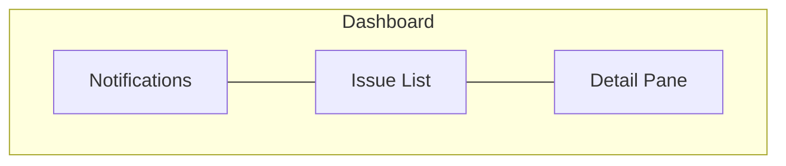

# Control Plane TUI

## Overview

The TUI is the user-facing module of the control plane. It renders a three-pane dashboard that surfaces workflow state, provides on-demand agent dispatch, streams agent output, and presents an interactive notification history. Built with Ink (React for the terminal), the TUI consumes all four engine interfaces (events, commands, queries, streams) via a `useEngine()` hook.

## Constraints

- Must not import or be imported by the engine module. The `useEngine()` hook is the only coupling point.
- Must remain responsive while agents are running. No blocking operations on the main render loop.
- Must not make GitHub API calls or invoke agents directly. All state changes flow through engine commands.
- Must render correctly in terminals with a minimum width of 120 columns and 30 rows.
- Must fill the terminal viewport exactly — no terminal scrolling. The dashboard height is bounded to `stdout.rows` and width to `stdout.columns`. Pane heights are derived from terminal dimensions and update on resize.

## Specification

### Layout

The dashboard is a three-pane horizontal layout:



```
┌──────────────────┬──────────────────┬──────────────────┐
│   Notifications   │    Issue List    │   Detail Pane    │
│                   │                  │                  │
│   Scrollable      │   All tracked    │   Context-aware  │
│   event history   │   issues,        │   content based  │
│                   │   ordered by     │   on selected    │
│   Interactive:    │   state +        │   issue          │
│   Enter opens     │   priority       │                  │
│   context in      │                  │                  │
│   browser         │   Enter to act   │                  │
│                   │   (dispatch,     │                  │
│                   │   open, retry)   │                  │
└──────────────────┴──────────────────┴──────────────────┘
```

The dashboard fills the terminal viewport exactly — its height is `stdout.rows` and its width is `stdout.columns`. The dashboard has no global chrome (no title bar, no status line) — each pane's total height is `stdout.rows`. No content extends beyond the viewport (no terminal scrolling). On terminal resize, the layout reflows to the new dimensions. Each pane's scrollable area is computed from `stdout.rows` minus that pane's chrome (header line + horizontal rule = 2 rows). The three panes divide horizontal space equally (each gets one-third of `stdout.columns`).

The issue list pane has focus by default on startup. The user navigates between panes and interacts with items using keyboard controls.

### Panes

#### Shared List Primitives

All list-based panes (notifications, issue list) share a common visual foundation implemented as reusable `List` and `ListItem` components.

**Pane header:** The pane label renders in full caps (e.g., `NOTIFICATIONS`, `ISSUES`) followed by a full-width horizontal rule (`─`). The header is visually distinct from the scrollable list content below it. The header has 1-character horizontal padding on each side.

**Item padding:** Each list item has 1-character horizontal padding on each side, matching the header. This keeps content visually inset from the pane border.

**Alternating row backgrounds:** Odd-indexed visible rows render with a dimmed background to visually distinguish adjacent items. Even-indexed rows use the terminal's default background. The index is based on visible position (after scroll windowing), not the item's index in the underlying data.

**Selection highlighting:** The currently selected item renders with inverse video (foreground and background colors swapped). Only the focused pane shows a selection highlight.

**Single-line truncation:** Each list item occupies exactly one terminal line. Content exceeding the available pane width is truncated with a trailing ellipsis (`…`).

**Scroll windowing:** Chrome for list-based panes is exactly 2 rows (header line + rule line). The visible item count is `stdout.rows - 2`. The pane header and horizontal rule are fixed — they never scroll off-screen. The scrollable area begins below the rule and displays up to `visible item count` items. When items exceed visible rows, the list scrolls within this area via keyboard navigation (`↑`/`↓`/`j`/`k`) or mouse scroll wheel. The viewport uses scroll-by-one: it shifts by exactly one row when the selection moves outside the currently visible window. Mouse scroll moves the viewport without changing the selected item. If the user mouse-scrolls away from the selected item then presses a navigation key, the viewport snaps back to keep the selection visible before applying the navigation. On terminal resize, the visible item count is recomputed from the new `stdout.rows`.

**Terminal hyperlinks:** Specific text elements render as clickable terminal hyperlinks via the OSC 8 protocol (`ink-link`). In terminals that do not support OSC 8, text renders normally without click behavior — no URL suffix is appended, since all linked resources are also accessible via keyboard actions (`Enter` to open in browser). Fallback is disabled (`fallback={false}`).

#### Notifications Pane

A scrollable, chronological event history that surfaces all engine events as user-readable entries. Newest notifications appear at the top. Uses the shared list primitives for header, alternating rows, selection highlighting, single-line truncation, and scroll windowing. See `control-plane-tui-notifications.md` for notification indicators, text formatting, semantic highlighting, context URL assignment, interaction, and type definitions.

#### Issue List Pane

A prioritized list of all open issues with the `task:implement` label. This is the primary interaction point — the user dispatches agents, monitors progress, and navigates to external resources from this pane. Uses the shared list primitives for header, alternating rows, selection highlighting, single-line truncation, and scroll windowing.

**Planner visibility:** Planner sessions do not appear in the issue list (they operate on specs, not task issues). Planner activity is visible only through notifications — `agentStarted`, `agentCompleted`, and `agentFailed` events for the Planner are surfaced in the notifications pane.

**Ordering:**

1. **Active agents pinned to top** — Issues with a running agent session (any status, active agent — includes both Implementors in `in-progress` and Reviewers in `review`) are pinned above all other issues.
2. **By priority** — `priority:high` → `priority:medium` → `priority:low`.
3. **By creation date** — Oldest first within the same priority (longest-waiting issues surface first).

**Issue display:** Each issue is a single line showing: priority indicator, issue number, title (truncated to fit), and a state indicator.

**State indicators:**

| Issue State | Indicator | Meaning |
|------------|-----------|---------|
| `pending`, `unblocked`, `needs-changes` | Ready marker | Dispatchable — user can start an Implementor |
| `in-progress` (agent running) | Spinner | Active Implementor session — pinned to top |
| `in-progress` (no agent) | Stale marker | Should not persist — engine recovery will reset to pending |
| `review` (Reviewer running) | Spinner | Active Reviewer session — pinned to top |
| `review` (no agent) | Review marker | PR awaiting human review |
| `needs-refinement` | Blocked marker | Spec issue — needs Human attention |
| `blocked` | Blocked marker | Non-spec blocker — needs Human attention |
| `approved` | Done marker | Ready for Human to merge |
| Failed (agent error) | Error marker | Agent session failed — retryable |

**Interaction:** Arrow keys navigate the list. Enter performs a context-aware action:

| Issue State | Enter Action |
|------------|-------------|
| `pending`, `unblocked`, `needs-changes` | Show dispatch confirmation: "Dispatch Implementor for #N? [y/n]". On `y`, send `dispatchImplementor` command. On `n`/`Escape`, dismiss. |
| `in-progress` (agent running) | Show cancel confirmation: "Cancel agent for #N? [y/n]". On `y`, send `cancelAgent` command. On `n`/`Escape`, dismiss. |
| `in-progress` (no agent) | Show dispatch confirmation (same as `pending`). The engine accepts `dispatchImplementor` for `in-progress` issues with no running agent (see engine spec, Command Interface). This is a transient state — engine recovery will reset it to `pending` shortly, but the user can dispatch immediately without waiting for recovery. |
| `review` (Reviewer running) | Show cancel confirmation: "Cancel Reviewer for #N? [y/n]". On `y`, send `cancelAgent` command. On `n`/`Escape`, dismiss. |
| `review` (no agent) | Open PR in browser (if PR exists). If no PR found, show "No PR found" in detail pane. |
| `needs-refinement` | Open issue in browser |
| `blocked` | Open issue in browser |
| `approved` | Open PR in browser |
| Failed | Show retry confirmation: "Retry {agentType} for #N? [y/n]" (agent type from `lastFailure`). On `y`, clear `lastFailure` and dispatch the appropriate agent (`dispatchImplementor` for Implementor failures, `dispatchReviewer` for Reviewer failures). On `n`/`Escape`, dismiss. |

**Empty state:** When the issue list is empty (no `task:implement` issues exist), the pane displays "No issues tracked". Arrow keys and Enter are no-ops. `selectedIssue` remains `null`.

#### Detail Pane

Displays context-aware content based on the currently selected issue in the issue list. Content changes automatically as the user navigates the issue list. The pane supports issue details, live agent output streaming, PR summaries, failure overlays, and an empty state — all within a scroll-windowed view. See `control-plane-tui-detail-pane.md` for pane header, scroll windowing, line truncation, content by issue state, on-demand fetching, agent output streaming, agent stream lifecycle, stream buffer limit, stale-while-revalidate caching, and type definitions.

### State Management

The TUI uses Zustand for state management. A single store holds all TUI state derived from engine events. This keeps state outside the React tree, avoids prop drilling, and allows any component to subscribe to exactly the slices it needs.

#### Store

The engine store is created once at startup and subscribes to all engine events. It exposes:

**State** (see `EngineStoreState` in Type Definitions):
- `repository` — `{ owner: string; repo: string }`. Set once at initialization from the engine config. Used to construct issue, PR, and commit URLs for hyperlinks and `contextURL`.
- `issues` — Map of issue number → `TrackedIssue`. Populated from `issueStatusChanged` events. Includes agent status (`agentRunning`, `agentType`) and optional `lastFailure` (error, session ID, worktree path, log file path).
- `notifications` — `Notification[]` (discriminated union on `eventType`). New notifications are prepended (index 0 is the newest). Each variant carries typed fields for its event — see Type Definitions.
- `agentStreams` — Map of issue number → `string[]` buffer. Populated by subscribing to the engine's `getAgentStream` on `agentStarted`.
- `issueDetails` — Cache of `CachedIssueDetails`. Populated via `getIssueDetails` when the user selects an issue. Invalidated on `issueStatusChanged`.
- `prDetails` — Cache of `CachedPRDetails`. Populated via `getPRForIssue` when the user selects a review/approved issue. Invalidated on `issueStatusChanged`.
- `focusedPane` — Currently focused pane (`'issueList'`, `'detailPane'`, `'notifications'`).
- `selectedIssue` — Currently selected issue number, or `null`.
- `plannerRunning` — Whether a Planner session is currently running. Set to `true` on Planner `agentStarted`, `false` on Planner `agentCompleted`/`agentFailed`.
- `shuttingDown` — Whether the shutdown sequence is active.
- `runningAgentCount` — Count of currently running agent sessions. Computed as a Zustand selector (not a stored field): count of issues where `agentRunning` is true, plus 1 if `plannerRunning` is true. Used in the quit confirmation prompt.

**Actions** (see `EngineStoreActions` in Type Definitions):
- `dispatchImplementor(issueNumber)` — Sends the dispatch command to the engine. Clears `lastFailure` for this issue.
- `dispatchReviewer(issueNumber)` — Sends the dispatch reviewer command to the engine. Clears `lastFailure` for this issue. Used for retrying failed Reviewers.
- `cancelAgent(issueNumber)` — Sends the cancel command to the engine for a task agent.
- `shutdown()` — Sets `shuttingDown` to `true`, then sends the shutdown command to the engine. Planner cancellation is handled by the engine internally during the shutdown sequence (see engine spec, Graceful Shutdown) — the TUI does not need a separate `cancelPlanner` action.
- `cycleFocus(direction)` — Moves focus to the next/previous pane.
- `selectIssue(issueNumber)` — Updates the selected issue and triggers on-demand data fetching (issue details, PR data) if not already cached. `selectedIssue` is set to `null` only programmatically (via `issueRemoved` handler or when the issue list becomes empty), never by direct user action.

**Failure tracking:** When the engine emits `agentFailed`, the store records `lastFailure` on the affected issue. The engine's crash recovery resets the GitHub status to `pending`, but the TUI overlays the failure state until the user retries or a non-recovery poll clears it. See `control-plane-tui-failure-overlay.md` for the full failure recording, clearing, rendering, and retry semantics.

**Agent stream lifecycle:** See `control-plane-tui-detail-pane.md` § Agent Stream Lifecycle for the full stream subscription, chunk splitting, buffer management, and Planner skip behavior.

**Stream buffer limit:** Each issue's stream buffer is capped at 10,000 lines (ring buffer). See `control-plane-tui-detail-pane.md` § Stream Buffer Limit for drop behavior and viewport offset adjustment.

**Event handling:** The store subscribes to all engine events in its initializer. Event-to-state mapping:

| Event | Store Update |
|-------|-------------|
| `issueStatusChanged` | Add notification ("#{N}: {oldStatus} → {newStatus}"). Upsert issue in `issues` (creates entry on first detection with `oldStatus: null`). Clears `lastFailure` and `resolutionGuidance` if status changed — **unless `isRecovery` is true** (recovery events must not clear the failure overlay; only user-initiated retry or a subsequent non-recovery poll clears it). Marks `issueDetails`/`prDetails` cache for this issue as stale (see stale-while-revalidate below). |
| `agentStarted` | **Planner:** set `plannerRunning: true`, add notification (derive `specCount` from `event.specPaths.length` — `specPaths` is guaranteed present when `agentType` is `'planner'`), skip issue state and stream subscription. **Implementor/Reviewer:** set `agentRunning: true` and `agentType` on the issue. Stream subscription and buffer management: see `control-plane-tui-detail-pane.md` § Agent Stream Lifecycle. |
| `agentCompleted` | **Planner:** set `plannerRunning: false`, add notification (derive `specCount` from `event.specPaths.length`; include `logFilePath` if present on the engine event). **Implementor:** set `agentRunning: false` on the issue, add notification with the issue URL as `contextURL` initially (and `logFilePath` if present), then call `getPRForIssue` asynchronously and update the notification's `contextURL` to the PR URL when it resolves (this is an exception to the append-only rule — in-place URL update only; no-op if the notification no longer exists). **Reviewer:** set `agentRunning: false` on the issue, mark `prDetails` as stale (Reviewer may have added approval or posted review comments), add notification (with `logFilePath` if present). |
| `agentFailed` | **Planner:** set `plannerRunning: false`, add notification (with `logFilePath` if present on the engine event), no `lastFailure`. **Implementor/Reviewer:** set `agentRunning: false` on the issue, record `lastFailure` (see `control-plane-tui-failure-overlay.md` § Failure Recording). |
| `agentSkipped` | **Task agents (Implementor/Reviewer):** no issue state change. Notification added (includes `issueNumber`). **Planner:** no issue state change (`plannerRunning` remains `true` — the existing Planner is still running). Notification added (includes deferred `specPaths`). |
| `dispatchReady` | No issue state change (the issue's status was already updated by `issueStatusChanged`). Notification added ("#{N} ready for dispatch"). |
| `notification` (engine event) | Add notification entry to history. Map the engine event's `statusLabel` to the `EngineEventNotification.notificationType` field (`'needs-refinement'`, `'blocked'`, or `'approved'`). Set `contextURL` from the engine event's `contextURL`. Set `resolutionGuidance` on the issue's `TrackedIssue` (from `event.resolutionGuidance`) — used by the detail pane for `needs-refinement`/`blocked` states. For `approved` status, the engine provides the issue URL initially — the store calls `getPRForIssue` asynchronously and updates `contextURL` to the PR URL when resolved (same in-place update pattern as `agentCompleted` Implementor). If `clipboardCommand` is present, include it in the notification for `c` keybinding. Note: this is a specific engine event type for notify-only tier issues — distinct from the TUI's concept of "notifications" (all engine events appear in the notifications pane). |
| `notificationDismissed` | Add dismissal entry to notification history ("#{N} dismissed"). Does not remove previous notification entries — the notification history is append-only. |
| `issueRemoved` | Add notification ("#{N} removed"). Remove issue from `issues` map. Clear associated `agentStreams`, `issueDetails`, and `prDetails` caches. If the removed issue is the currently `selectedIssue`, reset `selectedIssue` to `null`. Note: the engine guarantees `agentFailed` is emitted before `issueRemoved` for the same issue (if an agent was running). Handlers should be defensive — check issue existence before updating. |
| `recoveryPerformed` | Notification added. Issue state updated via the accompanying synthetic `issueStatusChanged` (emitted by the engine alongside `recoveryPerformed`). |
| `specChanged` | Notification added (`specFileName` is derived from `event.filePath` by extracting the last path segment). No issue state change. |

**Stale-while-revalidate caching:** Caches (`issueDetails`, `prDetails`) are marked stale on `issueStatusChanged` but not cleared — stale data is shown immediately while a background re-fetch updates it. See `control-plane-tui-detail-pane.md` § Stale-While-Revalidate Caching for full behavior, including failure retention and retry semantics.

No TUI component interacts with the engine directly — all reads go through store selectors; all writes go through store actions.

#### useEngine() Hook

The `useEngine()` hook initializes the store with an engine instance and returns it. Components use Zustand's `useStore()` with selectors to subscribe to specific state slices, minimizing re-renders.

```
const issues = useStore(engineStore, (s) => s.issues);
const dispatch = useStore(engineStore, (s) => s.dispatchImplementor);
```

This hook is the sole bridge between the engine and the TUI. It is called once at the top level; the store it returns is shared by all components.

#### Type Definitions

Reference types for the Zustand store. Note: `Map` types must be replaced with new instances (not mutated in place) on every update so Zustand's equality check detects changes and triggers React re-renders.

```ts
// agentType excludes 'planner' because Planner sessions are tracked via
// plannerRunning, not via the issues map. The TUI narrows the engine's
// AgentType ('planner' | 'implementor' | 'reviewer') to just task agents.
type TrackedIssue = {
  number: number;
  title: string;
  statusLabel: string;
  priorityLabel: string;
  createdAt: string; // ISO 8601
  agentRunning: boolean;
  agentType?: 'implementor' | 'reviewer'; // only meaningful when agentRunning is true — consumers must check agentRunning before reading
  lastFailure?: {
    agentType: 'implementor' | 'reviewer';
    error: string;
    sessionID: string;
    worktreePath?: string; // present for Implementor failures
    logFilePath?: string; // present when engine logging.agentSessions is enabled
  };
  resolutionGuidance?: string; // set by engine `notification` event for needs-refinement/blocked issues; cleared on non-recovery status change
};

// Notification types: See control-plane-tui-notifications.md § Type Definitions
// for BaseNotification, all notification variants, and the Notification union.
// Imported from the notifications module.

type FocusedPane = 'issueList' | 'detailPane' | 'notifications';

// Detail pane cache types: See control-plane-tui-detail-pane.md § Type Definitions
// for CachedIssueDetails and CachedPRDetails.

type Repository = { owner: string; repo: string };

type EngineStoreState = {
  // Configuration (set once at initialization)
  repository: Repository;
  // Derived from engine events
  issues: Map<number, TrackedIssue>;
  notifications: Notification[];
  agentStreams: Map<number, string[]>; // issue number → buffered lines (one string per terminal row)
  plannerRunning: boolean;
  // On-demand caches (populated via engine queries)
  issueDetails: Map<number, CachedIssueDetails>;
  prDetails: Map<number, CachedPRDetails>;
  // UI state
  focusedPane: FocusedPane;
  selectedIssue: number | null;
  shuttingDown: boolean;
  // runningAgentCount is a computed selector, not a stored field:
  // count of issues where agentRunning is true, plus 1 if plannerRunning is true
};

type EngineStoreActions = {
  dispatchImplementor: (issueNumber: number) => void;
  dispatchReviewer: (issueNumber: number) => void;
  cancelAgent: (issueNumber: number) => void;
  shutdown: () => void;
  cycleFocus: (direction: 'forward' | 'backward') => void;
  selectIssue: (issueNumber: number) => void;
};

type EngineStore = EngineStoreState & EngineStoreActions;

// Zustand selector (not a stored field):
// selectRunningAgentCount(state: EngineStoreState): number
// Returns count of issues where agentRunning is true, plus 1 if plannerRunning is true.
```

### Keyboard Controls

**Prompt rendering:** All confirmation prompts render as a centered overlay with a single-line border, positioned in the middle of the terminal viewport. Implemented as a reusable `Confirm` component.

```
┌───────────────────────────────┐
│  Dispatch Implementor for #39? │
│             [y/n]              │
└───────────────────────────────┘
```

**Prompt exclusivity:** Only one confirmation prompt can be active at a time. While a confirmation prompt is visible (dispatch, cancel, retry, or quit), other prompt-triggering keys (`Enter`, `q`) are ignored until the active prompt is dismissed via `y`, `n`, or `Escape`.

#### Global

| Key | Action |
|-----|--------|
| `Tab` | Cycle focus: Issue List → Detail Pane → Notifications → Issue List |
| `Shift+Tab` | Cycle focus in reverse |
| `q` | Show quit confirmation prompt |
| `y` (in quit prompt) | Confirm shutdown — sends `shutdown` command to engine |
| `n` / `Escape` (in quit prompt) | Cancel quit — return to previous focus |

#### Issue List (when focused)

| Key | Action |
|-----|--------|
| `↑` / `k` | Move selection up |
| `↓` / `j` | Move selection down |
| `Enter` | Context-aware action on selected issue (dispatch, open in browser, retry) |

#### Notifications (when focused)

| Key | Action |
|-----|--------|
| `↑` / `k` | Move selection up |
| `↓` / `j` | Move selection down |
| `Enter` | Open notification context in browser |
| `c` | Copy clipboard command to system clipboard (only for notifications that have one — e.g., `needs-refinement`). No-op if the notification has no clipboard command. |

#### Detail Pane (when focused)

| Key | Action |
|-----|--------|
| `↑` / `k` | Scroll up |
| `↓` / `j` | Scroll down |

### Opening External Resources

Several interactions open resources in the user's default browser. The TUI uses the system's `open` command (or equivalent) to launch URLs:

| Resource | URL Pattern |
|----------|------------|
| Issue | `https://github.com/{owner}/{repo}/issues/{number}` |
| Pull Request | `https://github.com/{owner}/{repo}/pull/{number}` |
| Spec diff | `https://github.com/{owner}/{repo}/commit/{sha}` |

The `{owner}/{repo}` values come from the engine's `repository` config.

### Startup

On startup, the TUI:

1. Initializes the `useEngine()` hook with the engine instance. The store subscribes to all engine events (via `engine.on()`) in its initializer — this must happen before `start()` is called so that startup recovery events are not lost (see engine spec, Engine Interface, startup contract).
2. Calls `engine.start()`, which returns a `Promise<StartupResult>` that resolves after planner cache load, startup recovery, and the first IssuePoller and SpecPoller cycles both complete. The TUI shows a centered loading spinner with "Starting…" text until the Promise resolves. The three-pane layout is not rendered during startup.
3. Renders the three-pane layout with the issue list focused. If issues exist, the first issue in sort order is auto-selected (`selectedIssue` is set). If no issues exist, `selectedIssue` remains `null`.
4. Displays a startup summary notification using the `StartupResult`: "Startup complete: {issueCount} issues tracked, {recoveriesPerformed} recoveries performed" (recoveries clause omitted if zero).

### Shutdown

When the user presses `q`:

1. The TUI displays a confirmation prompt: "Quit? N agent(s) running. [y/n]". If no agents are running, the prompt reads: "Quit? [y/n]".
2. If the user presses `n` or `Escape`, the prompt is dismissed and focus returns to the previous pane.
3. If the user presses `y`, the TUI sends the `shutdown` command to the engine.
4. The TUI displays a shutdown status: "Shutting down... waiting for N agent(s)".
5. As agents complete, the count updates.
6. When all agents are done (or timeout reached), the TUI exits.

## Acceptance Criteria

### Layout

- [ ] Given the TUI starts, when the dashboard renders, then three panes are visible: notifications, issue list, and detail pane.
- [ ] Given the TUI starts, when the dashboard renders, then the issue list pane has focus.
- [ ] Given the terminal is at least 120 columns wide and 30 rows tall, when the TUI renders, then all three panes are visible without overlap or truncation.
- [ ] Given the TUI is running, when the terminal is resized, then the layout reflows to fill the new dimensions without terminal scrolling.
- [ ] Given the TUI is running, when content exceeds the available pane height, then the content scrolls within the pane — the overall dashboard never exceeds the terminal viewport.

### Issue List

- [ ] Given issues exist with different priorities, when the issue list renders, then issues are ordered by active agents first, then priority (high → medium → low), then creation date (oldest first).
- [ ] Given an Implementor is dispatched for an issue, when the agent starts, then the issue is pinned to the top of the list with a spinner indicator.
- [ ] Given a pending issue is selected, when the user presses Enter, then a dispatch confirmation prompt is shown. On `y`, the `dispatchImplementor` command is sent to the engine.
- [ ] Given an issue in `review` with no running Reviewer is selected, when the user presses Enter, then the PR is opened in the user's browser (if PR exists).
- [ ] Given a failed issue is selected, when the user presses Enter, then a retry confirmation prompt is shown. On `y`, `lastFailure` is cleared and the appropriate agent is dispatched (matching `lastFailure.agentType`).
- [ ] Given an issue with a running agent is selected, when the user presses Enter, then a cancel confirmation prompt is shown. On `y`, the `cancelAgent` command is sent to the engine.
- [ ] Given more issues exist than visible rows, when the user navigates past the visible area, then the list scrolls to keep the selected item in view.
- [ ] Given no `task:implement` issues exist, when the issue list renders, then the pane displays "No issues tracked" and `selectedIssue` remains `null`.

### Detail Pane

See `control-plane-tui-detail-pane.md` for all detail pane acceptance criteria.

### Shared List Primitives

- [ ] Given any list-based pane renders, when the pane header is displayed, then the label is in full caps with a horizontal rule (`─`) separator below.
- [ ] Given a list has multiple items, when the list renders, then odd-indexed visible rows have a dimmed background and even-indexed rows have the default background.
- [ ] Given a list item is selected in the focused pane, when the list renders, then the selected item is displayed with inverse video.
- [ ] Given a list item's content exceeds the pane width, when the item renders, then the content is truncated with a trailing ellipsis (`…`).
- [ ] Given more items exist than the pane height allows, when the user navigates past the visible window, then the list scrolls by one row to keep the selected item visible while the pane header remains fixed.
- [ ] Given more items exist than the pane height allows, when the user scrolls with the mouse wheel, then the viewport moves without changing the selected item and the pane header remains fixed.
- [ ] Given the user has mouse-scrolled away from the selected item, when they press a navigation key, then the viewport snaps back to the selection before applying the navigation.
- [ ] Given a text element is a terminal hyperlink, when rendered in a supported terminal, then it is clickable. In unsupported terminals, no URL suffix is appended.

### Notifications

See `control-plane-tui-notifications.md` for all notifications pane acceptance criteria.

### Keyboard Navigation

- [ ] Given the issue list is focused, when the user presses Tab, then focus moves to the detail pane.
- [ ] Given any pane is focused, when the user presses Shift+Tab, then focus moves to the previous pane.
- [ ] Given any pane is focused, when the user presses `q`, then a quit confirmation prompt is displayed.
- [ ] Given the quit confirmation prompt is displayed, when the user presses `y`, then the shutdown sequence begins.
- [ ] Given the quit confirmation prompt is displayed, when the user presses `n` or `Escape`, then the prompt is dismissed and focus returns to the previous pane.
- [ ] Given a confirmation prompt is displayed, then it renders as a centered bordered overlay.
- [ ] Given the issue list is focused, when the user presses `j` or `↓`, then the selection moves down one item.
- [ ] Given any confirmation prompt is displayed, when the user presses `Escape`, then the prompt is dismissed (equivalent to pressing `n`).

### Failure Overlay

See `control-plane-tui-failure-overlay.md` for all failure overlay acceptance criteria (recording, clearing, rendering, retry flow).

### Integration

- [ ] Given the engine emits an `issueStatusChanged` event, when the TUI processes it, then the issue list and detail pane update to reflect the new state.
- [ ] Given the engine emits a `dispatchReady` event, when the TUI processes it, then a notification is added and no issue state change occurs — the ready indicator was already applied from the preceding `issueStatusChanged` event.
- [ ] Given the engine emits an `agentStarted` event, when the TUI processes it, then the store subscribes to the agent's output stream via `getAgentStream`.
- [ ] Given a running agent is producing output, when the TUI receives stream data, then newline-split lines are buffered in `agentStreams` and renderable in the detail pane without blocking other panes.
- [ ] Given the user selects an issue, when its detail data is not cached, then the store fetches it via `getIssueDetails` or `getPRForIssue` and shows a loading indicator until the data arrives.
- [ ] Given the user selects an issue, when its detail data is cached but stale, then the cached data is shown immediately while a background re-fetch updates it.
- [ ] Given the engine emits `issueRemoved`, when the TUI processes it, then the issue is removed from the issue list and all associated caches are cleared. If the removed issue is the currently selected issue, `selectedIssue` is reset to `null`.
- [ ] Given an agent's stream buffer has reached 10,000 lines, when a new line arrives, then the oldest line is dropped and the new line is appended (ring buffer).
- [ ] Given a Planner `agentStarted` event is emitted, when the TUI processes it, then `plannerRunning` is set to `true` and the running agent count includes the Planner.
- [ ] Given a Planner `agentCompleted` event is emitted, when the TUI processes it, then `plannerRunning` is set to `false` and the running agent count decreases.
- [ ] Given a stale cache re-fetch fails, when the failure occurs, then the stale data is retained and the cache remains stale for the next view attempt.
- [ ] Given two Implementors and one Planner are running, when `runningAgentCount` is computed, then it returns 3.
- [ ] Given the engine emits a `notification` event for `needs-refinement` or `blocked`, when the store processes it, then `resolutionGuidance` is set on the affected issue's `TrackedIssue`.
- [ ] Given an issue has `resolutionGuidance` set, when a non-recovery `issueStatusChanged` fires for that issue, then `resolutionGuidance` is cleared.
- [ ] Given an issue has `resolutionGuidance` set, when a recovery `issueStatusChanged` (`isRecovery: true`) fires for that issue, then `resolutionGuidance` is not cleared.
- [ ] Given the engine emits a `notification` event for `approved`, when the store processes it, then `getPRForIssue` is called asynchronously and the notification's `contextURL` is updated to the PR URL when resolved.

## Dependencies

- `control-plane.md` — Parent architecture spec (data flow, `useEngine()` hook contract)
- `control-plane-engine.md` — Engine specification (events, commands, queries, streams, agent lifecycle)
- `control-plane-tui-notifications.md` — Notifications pane sub-spec (indicators, text, highlighting, interaction, notification types)
- `control-plane-tui-detail-pane.md` — Detail pane sub-spec (content by state, streaming, caching, scroll windowing, cached types)
- `control-plane-tui-failure-overlay.md` — Failure overlay sub-spec (recording, clearing, rendering, retry)
- `workflow.md` — Status labels, issue structure

## References

- `control-plane-tui-notifications.md` — Notifications pane rendering, indicators, semantic highlighting, type definitions
- `control-plane-tui-detail-pane.md` — Detail pane content, scroll windowing, streaming, caching, type definitions
- `control-plane-tui-failure-overlay.md` — Failure overlay behavior (recording, clearing, rendering, retry)
- [Ink](https://github.com/vadimdemedes/ink) — React for the terminal (TUI framework)
- [ink-link](https://github.com/sindresorhus/ink-link) — Terminal hyperlinks (OSC 8) for Ink
