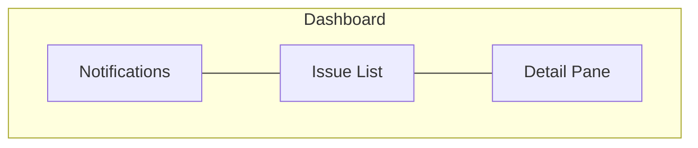

# Control Plane TUI

## Overview

The TUI is the user-facing module of the control plane. It renders a three-pane dashboard that surfaces workflow state, provides on-demand agent dispatch, streams agent output, and presents an interactive notification history. Built with Ink (React for the terminal), the TUI consumes all four engine interfaces (events, commands, queries, streams) via a `useEngine()` hook.

## Constraints

- Must not import or be imported by the engine module. The `useEngine()` hook is the only coupling point.
- Must remain responsive while agents are running. No blocking operations on the main render loop.
- Must not make GitHub API calls or invoke agents directly. All state changes flow through engine commands.
- Must render correctly in terminals with a minimum width of 120 columns and 30 rows.

## Specification

### Layout

The dashboard is a three-pane horizontal layout:



```
┌──────────────────┬──────────────────┬──────────────────┐
│   Notifications   │    Issue List    │   Detail Pane    │
│                   │                  │                  │
│   Scrollable      │   All tracked    │   Context-aware  │
│   event history   │   issues,        │   content based  │
│                   │   ordered by     │   on selected    │
│   Interactive:    │   state +        │   issue          │
│   Enter opens     │   priority       │                  │
│   context in      │                  │                  │
│   browser         │   Enter to act   │                  │
│                   │   (dispatch,     │                  │
│                   │   open, retry)   │                  │
└──────────────────┴──────────────────┴──────────────────┘
```

The issue list pane has focus by default on startup. The user navigates between panes and interacts with items using keyboard controls.

### Panes

#### Notifications Pane

A scrollable, chronological event history. Newest notifications appear at the top.

**Content:** Each notification is a single-line entry showing a timestamp, event type icon, and summary text. Notifications that carry a clipboard command (e.g., `needs-refinement`) display a copy indicator. Notifications persist for the entire session as scrollable history.

**Events surfaced as notifications:**

| Engine Event | Notification Text |
|-------------|-------------------|
| `agentStarted` | "{AgentType} started for issue #{N}" (Implementor/Reviewer) or "Planner started for {spec paths}" (Planner) |
| `agentCompleted` | "{AgentType} completed for issue #{N}" (Implementor/Reviewer) or "Planner completed" (Planner) |
| `agentFailed` | "{AgentType} failed for issue #{N} — {error}" (Implementor/Reviewer) or "Planner failed — {error}" (Planner). Includes session ID. |
| `issueStatusChanged` | Issue #N status changed from X to Y |
| `specChanged` | "Spec changed: {filePath}". The `contextURL` is constructed from the commit SHA (for Enter/browser diff action). |
| `recoveryPerformed` | Issue #N recovered from stale in-progress |
| `notification` (engine) | "Issue #{N} requires attention — {status}" for `needs-refinement`/`blocked`, or "Issue #{N} approved — ready to merge" for `approved` |
| `agentSkipped` | "{AgentType} skipped for issue #{N} — already running" (Implementor/Reviewer) or "Planner skipped — already running (paths deferred)" (Planner) |
| `dispatchReady` | "Issue #{N} ready for dispatch" |
| `notificationDismissed` | Issue #N notification dismissed |

**Interaction:** When the notifications pane is focused, arrow keys scroll through entries. Enter on a notification opens the relevant context:

| Event Type | Enter Action |
|-----------|-------------|
| Issue-related events | Open issue in browser |
| Agent completed (Implementor) | Open PR in browser (if PR exists) |
| Spec changed | Open file diff in browser |

#### Issue List Pane

A prioritized list of all open issues with the `task:implement` label. This is the primary interaction point — the user dispatches agents, monitors progress, and navigates to external resources from this pane.

**Planner visibility:** Planner sessions do not appear in the issue list (they operate on specs, not task issues). Planner activity is visible only through notifications — `agentStarted`, `agentCompleted`, and `agentFailed` events for the Planner are surfaced in the notifications pane.

**Ordering:**

1. **Active agents pinned to top** — Issues with a running agent session (any status, active agent — includes both Implementors in `in-progress` and Reviewers in `review`) are pinned above all other issues.
2. **By priority** — `priority:high` → `priority:medium` → `priority:low`.
3. **By creation date** — Oldest first within the same priority (longest-waiting issues surface first).

**Issue display:** Each issue is a single line showing: priority indicator, issue number, title (truncated to fit), and a state indicator.

**State indicators:**

| Issue State | Indicator | Meaning |
|------------|-----------|---------|
| `pending`, `unblocked`, `needs-changes` | Ready marker | Dispatchable — user can start an Implementor |
| `in-progress` (agent running) | Spinner | Active Implementor session — pinned to top |
| `in-progress` (no agent) | Stale marker | Should not persist — engine recovery will reset to pending |
| `review` (Reviewer running) | Spinner | Active Reviewer session — pinned to top |
| `review` (no agent) | Review marker | PR awaiting human review |
| `needs-refinement` | Blocked marker | Spec issue — needs Human attention |
| `blocked` | Blocked marker | Non-spec blocker — needs Human attention |
| `approved` | Done marker | Ready for Human to merge |
| Failed (agent error) | Error marker | Agent session failed — retryable |

**Interaction:** Arrow keys navigate the list. Enter performs a context-aware action:

| Issue State | Enter Action |
|------------|-------------|
| `pending`, `unblocked`, `needs-changes` | Show dispatch confirmation: "Dispatch Implementor for #N? [y/n]". On `y`, send `dispatchImplementor` command. On `n`/`Escape`, dismiss. |
| `in-progress` (agent running) | Show cancel confirmation: "Cancel agent for #N? [y/n]". On `y`, send `cancelAgent` command. On `n`/`Escape`, dismiss. |
| `review` (Reviewer running) | Show cancel confirmation: "Cancel Reviewer for #N? [y/n]". On `y`, send `cancelAgent` command. On `n`/`Escape`, dismiss. |
| `review` (no agent) | Open PR in browser (if PR exists). If no PR found, show "No PR found" in detail pane. |
| `needs-refinement` | Open issue in browser |
| `blocked` | Open issue in browser |
| `approved` | Open PR in browser |
| Failed | Show retry confirmation: "Retry {agentType} for #N? [y/n]" (agent type from `lastFailure`). On `y`, clear `lastFailure` and dispatch the appropriate agent (`dispatchImplementor` for Implementor failures, `dispatchReviewer` for Reviewer failures). On `n`/`Escape`, dismiss. |

**Empty state:** When the issue list is empty (no `task:implement` issues exist), the pane displays "No issues tracked". Arrow keys and Enter are no-ops. `selectedIssue` remains `null`.

The list displays as many issues as terminal height allows. If there are more issues than visible rows, the list scrolls to keep the selected item in view.

#### Detail Pane

Displays context-aware content based on the currently selected issue in the issue list. The content changes automatically as the user navigates the issue list.

| Selected Issue State | Detail Pane Content | Data Source |
|---------------------|---------------------|-------------|
| `pending`, `unblocked`, `needs-changes` | Issue details: objective, spec reference, scope, acceptance criteria | `getIssueDetails` query (cached in `issueDetails`) |
| `in-progress` (agent running) | Live streaming Implementor output | `getAgentStream` stream accessor (buffered in `agentStreams`) |
| `review` (Reviewer running) | Live streaming Reviewer output | `getAgentStream` stream accessor (buffered in `agentStreams`) |
| `review` (no agent) | PR summary — title, changed files count, CI status | `getPRForIssue` query (cached in `prDetails`) |
| `needs-refinement`, `blocked` | Issue details + blocker comment | `getIssueDetails` query (cached in `issueDetails`) |
| `approved` | PR summary — ready for merge | `getPRForIssue` query (cached in `prDetails`) |
| Failed (TUI overlay) | Error details, session ID, preserved worktree path (if Implementor), retry prompt | `lastFailure` from Zustand store |
| No issue selected (`selectedIssue` is `null`) | Empty state: "No issue selected" | N/A |

**On-demand fetching:** When the user selects an issue, the store checks its `issueDetails`/`prDetails` caches. If the data is not cached, it calls the engine's query interface to fetch it. A loading indicator is shown in the detail pane while the fetch is in progress.

**Agent output streaming:** When viewing a running agent, the detail pane renders from the `agentStreams` buffer. The stream auto-scrolls to show the latest output. The user can scroll up to review earlier output; auto-scroll resumes when the user scrolls back to the bottom.

**Failure overlay:** When an issue has a `lastFailure` in the store, the detail pane shows the error state regardless of the GitHub status label. This allows the user to see the error and retry before the issue reverts to its normal pending appearance.

### State Management

The TUI uses Zustand for state management. A single store holds all TUI state derived from engine events. This keeps state outside the React tree, avoids prop drilling, and allows any component to subscribe to exactly the slices it needs.

#### Store

The engine store is created once at startup and subscribes to all engine events. It exposes:

**State** (see `EngineStoreState` in Type Definitions):
- `issues` — Map of issue number → `TrackedIssue`. Populated from `issueStatusChanged` events. Includes agent status (`agentRunning`, `agentType`) and optional `lastFailure` (error, session ID, worktree path).
- `notifications` — Chronological `Notification[]`. Each entry has a context URL (for Enter/browser) and an optional clipboard command (for `c` keybinding).
- `agentStreams` — Map of issue number → `string[]` buffer. Populated by subscribing to the engine's `getAgentStream` on `agentStarted`.
- `issueDetails` — Cache of `CachedIssueDetails`. Populated via `getIssueDetails` when the user selects an issue. Invalidated on `issueStatusChanged`.
- `prDetails` — Cache of `CachedPRDetails`. Populated via `getPRForIssue` when the user selects a review/approved issue. Invalidated on `issueStatusChanged`.
- `focusedPane` — Currently focused pane (`'issueList'`, `'detailPane'`, `'notifications'`).
- `selectedIssue` — Currently selected issue number, or `null`.
- `plannerRunning` — Whether a Planner session is currently running. Set to `true` on Planner `agentStarted`, `false` on Planner `agentCompleted`/`agentFailed`.
- `shuttingDown` — Whether the shutdown sequence is active.
- `runningAgentCount` — Count of currently running agent sessions. Computed as a Zustand selector (not a stored field): count of issues where `agentRunning` is true, plus 1 if `plannerRunning` is true. Used in the quit confirmation prompt.

**Actions** (see `EngineStoreActions` in Type Definitions):
- `dispatchImplementor(issueNumber)` — Sends the dispatch command to the engine. Clears `lastFailure` for this issue.
- `dispatchReviewer(issueNumber)` — Sends the dispatch reviewer command to the engine. Clears `lastFailure` for this issue. Used for retrying failed Reviewers.
- `cancelAgent(issueNumber)` — Sends the cancel command to the engine for a task agent.
- `shutdown()` — Sends the shutdown command to the engine. Planner cancellation is handled by the engine internally during the shutdown sequence (see engine spec, Graceful Shutdown) — the TUI does not need a separate `cancelPlanner` action.
- `cycleFocus(direction)` — Moves focus to the next/previous pane.
- `selectIssue(issueNumber)` — Updates the selected issue and triggers on-demand data fetching (issue details, PR data) if not already cached. `selectedIssue` is set to `null` only programmatically (via `issueRemoved` handler or when the issue list becomes empty), never by direct user action.

**Failure tracking:** When the engine emits `agentFailed`, the store records `lastFailure` on the affected issue with the error details, session ID, and preserved worktree path (if Implementor). The engine's crash recovery resets the GitHub status to `pending`, but the TUI overlays the failure state — displaying the error indicator and retry action instead of the ready indicator. The `lastFailure` is cleared when the user dispatches a retry (Enter on a failed issue) or when the issue's status changes via a subsequent poll. The session ID is surfaced in the failure detail view so the user can manually resume the session outside the control plane if desired.

**Agent stream lifecycle:** When the engine emits `agentStarted` for an issue, the store calls `getAgentStream(issueNumber)` on the engine and begins consuming the async iterable, appending chunks to the `agentStreams` buffer. For Planner `agentStarted` events (which have no `issueNumber`), the store skips stream subscription — Planner output is not streamed to the detail pane. When the stream ends (agent completes or fails), the buffer is retained for review until the issue state changes.

**Stream buffer limit:** Each issue's stream buffer is capped at 10,000 chunks. When the buffer exceeds this limit, the oldest chunks are dropped (ring buffer). This prevents unbounded memory growth from verbose agent sessions.

**Event handling:** The store subscribes to all engine events in its initializer. Event-to-state mapping:

| Event | Store Update |
|-------|-------------|
| `issueStatusChanged` | Upsert issue in `issues` (creates entry on first detection with `oldStatus: null`). Clears `lastFailure` if status changed — **unless `isRecovery` is true** (recovery events must not clear the failure overlay; only user-initiated retry or a subsequent non-recovery poll clears it). Marks `issueDetails`/`prDetails` cache for this issue as stale (see stale-while-revalidate below). |
| `agentStarted` | **Planner:** set `plannerRunning: true`, add notification, skip issue state and stream subscription. **Implementor/Reviewer:** set `agentRunning: true` and `agentType` on the issue identified by `issueNumber`. Clear any existing `agentStreams` buffer for this issue (from a previous run), then subscribe to `getAgentStream(issueNumber)` and begin buffering in `agentStreams`. |
| `agentCompleted` | **Planner:** set `plannerRunning: false`, add notification. **Implementor:** set `agentRunning: false` on the issue, add notification with the issue URL as `contextURL` initially, then call `getPRForIssue` asynchronously and update the notification's `contextURL` to the PR URL when it resolves (this is an exception to the append-only rule — in-place URL update only; no-op if the notification no longer exists). **Reviewer:** set `agentRunning: false` on the issue, mark `prDetails` as stale (Reviewer may have added approval or posted review comments), add notification. |
| `agentFailed` | **Planner:** set `plannerRunning: false`, add notification, no `lastFailure`. **Implementor/Reviewer:** set `agentRunning: false` on the issue identified by `issueNumber`, record `lastFailure` with `agentType`, error, session ID, and worktree path (Implementor only). |
| `agentSkipped` | No issue state change. Notification added. |
| `dispatchReady` | No issue state change (the issue's status was already updated by `issueStatusChanged`). Notification added ("Issue #{N} ready for dispatch"). |
| `notification` (engine event) | Add notification entry to history. Set `contextURL` from the engine event's `contextURL`. For `approved` status, the engine provides the issue URL initially — the store calls `getPRForIssue` asynchronously and updates `contextURL` to the PR URL when resolved (same in-place update pattern as `agentCompleted` Implementor). If `clipboardCommand` is present, include it in the notification for `c` keybinding. Note: this is a specific engine event type for notify-only tier issues — distinct from the TUI's concept of "notifications" (all engine events appear in the notifications pane). |
| `notificationDismissed` | Add dismissal entry to notification history ("Issue #N notification dismissed"). Does not remove previous notification entries — the notification history is append-only. |
| `issueRemoved` | Remove issue from `issues` map. Clear associated `agentStreams`, `issueDetails`, and `prDetails` caches. If the removed issue is the currently `selectedIssue`, reset `selectedIssue` to `null`. Note: the engine guarantees `agentFailed` is emitted before `issueRemoved` for the same issue (if an agent was running). Handlers should be defensive — check issue existence before updating. |
| `recoveryPerformed` | Notification added. Issue state updated via the accompanying synthetic `issueStatusChanged` (emitted by the engine alongside `recoveryPerformed`). |
| `specChanged` | Notification added. No issue state change. |

**Stale-while-revalidate caching:** When `issueStatusChanged` fires, the `issueDetails` and `prDetails` caches for that issue are marked as stale but not cleared. If the user navigates to the issue, the stale cached data is shown immediately while a background re-fetch updates it. If no cached data exists, a loading indicator is shown. This avoids loading-spinner flashes on routine status changes that don't alter the underlying data. If the background re-fetch fails (network error, API error), the stale cached data is retained and the failure is logged. The cache remains marked stale so the next view attempt will retry.

No TUI component interacts with the engine directly — all reads go through store selectors; all writes go through store actions.

#### useEngine() Hook

The `useEngine()` hook initializes the store with an engine instance and returns it. Components use Zustand's `useStore()` with selectors to subscribe to specific state slices, minimizing re-renders.

```
const issues = useStore(engineStore, (s) => s.issues);
const dispatch = useStore(engineStore, (s) => s.dispatchImplementor);
```

This hook is the sole bridge between the engine and the TUI. It is called once at the top level; the store it returns is shared by all components.

#### Type Definitions

Reference types for the Zustand store. Note: `Map` types must be replaced with new instances (not mutated in place) on every update so Zustand's equality check detects changes and triggers React re-renders.

```ts
// agentType excludes 'planner' because Planner sessions are tracked via
// plannerRunning, not via the issues map. The TUI narrows the engine's
// AgentType ('planner' | 'implementor' | 'reviewer') to just task agents.
type TrackedIssue = {
  number: number;
  title: string;
  statusLabel: string;
  priorityLabel: string;
  createdAt: string; // ISO 8601
  agentRunning: boolean;
  agentType?: 'implementor' | 'reviewer';
  lastFailure?: {
    agentType: 'implementor' | 'reviewer';
    error: string;
    sessionID: string;
    worktreePath?: string; // present for Implementor failures
  };
};

type Notification = {
  id: string; // unique, generated by store
  timestamp: string; // ISO 8601
  eventType: string; // engine event type that triggered this notification
  issueNumber?: number; // present for issue-related events, absent for spec/planner events
  summary: string; // human-readable one-line summary
  contextURL?: string; // URL opened by Enter (issue, PR, or commit)
  clipboardCommand?: string; // CLI command copied by 'c' keybinding
};

type FocusedPane = 'issueList' | 'detailPane' | 'notifications';

// number, title, and createdAt are available from TrackedIssue; only
// supplemental fields from the engine's IssueDetailsResult are cached here.
type CachedIssueDetails = {
  body: string;
  labels: string[];
  stale: boolean; // marked stale on issueStatusChanged, re-fetched on next view
};

type CachedPRDetails = {
  number: number;
  title: string;
  changedFilesCount: number;
  ciStatus: 'pending' | 'success' | 'failure';
  url: string;
  stale: boolean;
};

type EngineStoreState = {
  // Derived from engine events
  issues: Map<number, TrackedIssue>;
  notifications: Notification[];
  agentStreams: Map<number, string[]>; // issue number → buffered text chunks
  plannerRunning: boolean;
  // On-demand caches (populated via engine queries)
  issueDetails: Map<number, CachedIssueDetails>;
  prDetails: Map<number, CachedPRDetails>;
  // UI state
  focusedPane: FocusedPane;
  selectedIssue: number | null;
  shuttingDown: boolean;
  // runningAgentCount is a computed selector, not a stored field:
  // count of issues where agentRunning is true, plus 1 if plannerRunning is true
};

type EngineStoreActions = {
  dispatchImplementor: (issueNumber: number) => void;
  dispatchReviewer: (issueNumber: number) => void;
  cancelAgent: (issueNumber: number) => void;
  shutdown: () => void;
  cycleFocus: (direction: 'forward' | 'backward') => void;
  selectIssue: (issueNumber: number) => void;
};

type EngineStore = EngineStoreState & EngineStoreActions;
```

### Keyboard Controls

**Prompt exclusivity:** Only one confirmation prompt can be active at a time. While a confirmation prompt is visible (dispatch, cancel, retry, or quit), other prompt-triggering keys (`Enter`, `q`) are ignored until the active prompt is dismissed via `y`, `n`, or `Escape`.

#### Global

| Key | Action |
|-----|--------|
| `Tab` | Cycle focus: Issue List → Detail Pane → Notifications → Issue List |
| `Shift+Tab` | Cycle focus in reverse |
| `q` | Show quit confirmation prompt |
| `y` (in quit prompt) | Confirm shutdown — sends `shutdown` command to engine |
| `n` / `Escape` (in quit prompt) | Cancel quit — return to previous focus |

#### Issue List (when focused)

| Key | Action |
|-----|--------|
| `↑` / `k` | Move selection up |
| `↓` / `j` | Move selection down |
| `Enter` | Context-aware action on selected issue (dispatch, open in browser, retry) |

#### Notifications (when focused)

| Key | Action |
|-----|--------|
| `↑` / `k` | Scroll up |
| `↓` / `j` | Scroll down |
| `Enter` | Open notification context in browser |
| `c` | Copy clipboard command to system clipboard (only for notifications that have one — e.g., `needs-refinement`). No-op if the notification has no clipboard command. |

#### Detail Pane (when focused)

| Key | Action |
|-----|--------|
| `↑` / `k` | Scroll up |
| `↓` / `j` | Scroll down |

### Opening External Resources

Several interactions open resources in the user's default browser. The TUI uses the system's `open` command (or equivalent) to launch URLs:

| Resource | URL Pattern |
|----------|------------|
| Issue | `https://github.com/{owner}/{repo}/issues/{number}` |
| Pull Request | `https://github.com/{owner}/{repo}/pull/{number}` |
| Spec diff | `https://github.com/{owner}/{repo}/commit/{sha}` |

The `{owner}/{repo}` values come from the engine's `repository` config.

### Startup

On startup, the TUI:

1. Initializes the `useEngine()` hook with the engine instance.
2. Calls `engine.start()`, which returns a `Promise<StartupResult>` that resolves after startup recovery and the first IssuePoller and SpecPoller cycles both complete. The TUI shows a loading indicator until the Promise resolves.
3. Renders the three-pane layout with the issue list focused.
4. Displays a startup summary notification using the `StartupResult`: "Startup complete: {issueCount} issues tracked, {recoveriesPerformed} recoveries performed" (recoveries omitted if zero).

### Shutdown

When the user presses `q`:

1. The TUI displays a confirmation prompt: "Quit? N agent(s) running. [y/n]". If no agents are running, the prompt reads: "Quit? [y/n]".
2. If the user presses `n` or `Escape`, the prompt is dismissed and focus returns to the previous pane.
3. If the user presses `y`, the TUI sends the `shutdown` command to the engine.
4. The TUI displays a shutdown status: "Shutting down... waiting for N agent(s)".
5. As agents complete, the count updates.
6. When all agents are done (or timeout reached), the TUI exits.

## Acceptance Criteria

### Layout

- [ ] Given the TUI starts, when the dashboard renders, then three panes are visible: notifications, issue list, and detail pane.
- [ ] Given the TUI starts, when the dashboard renders, then the issue list pane has focus.
- [ ] Given the terminal is at least 120 columns wide and 30 rows tall, when the TUI renders, then all three panes are visible without overlap or truncation.

### Issue List

- [ ] Given issues exist with different priorities, when the issue list renders, then issues are ordered by active agents first, then priority (high → medium → low), then creation date (oldest first).
- [ ] Given an Implementor is dispatched for an issue, when the agent starts, then the issue is pinned to the top of the list with a spinner indicator.
- [ ] Given a pending issue is selected, when the user presses Enter, then a dispatch confirmation prompt is shown. On `y`, the `dispatchImplementor` command is sent to the engine.
- [ ] Given an issue in `review` with no running Reviewer is selected, when the user presses Enter, then the PR is opened in the user's browser (if PR exists).
- [ ] Given a failed issue is selected, when the user presses Enter, then a retry confirmation prompt is shown. On `y`, `lastFailure` is cleared and the appropriate agent is dispatched (matching `lastFailure.agentType`).
- [ ] Given an issue with a running agent is selected, when the user presses Enter, then a cancel confirmation prompt is shown. On `y`, the `cancelAgent` command is sent to the engine.
- [ ] Given more issues exist than visible rows, when the user navigates past the visible area, then the list scrolls to keep the selected item in view.

### Detail Pane

- [ ] Given a pending issue is selected in the issue list, when the detail pane renders, then it displays the issue body (objective, scope, acceptance criteria).
- [ ] Given an issue with a running Implementor is selected, when the detail pane renders, then it streams live Implementor output.
- [ ] Given an issue in `review` with a running Reviewer is selected, when the detail pane renders, then it streams live Reviewer output.
- [ ] Given an issue in `review` with no running Reviewer is selected, when the detail pane renders, then it displays the PR summary.
- [ ] Given a running agent's output is streaming, when new output arrives, then the detail pane auto-scrolls to show the latest output.
- [ ] Given the user scrolls up in the agent stream, when new output arrives, then auto-scroll is paused until the user scrolls back to the bottom.
- [ ] Given a failed issue is selected, when the detail pane renders, then it shows error details, session ID, and the preserved worktree path.

### Notifications

- [ ] Given an engine event occurs, when the notification is added, then it appears at the top of the notifications pane with a timestamp and event summary.
- [ ] Given notifications exist, when the user scrolls the notifications pane, then all session notifications are accessible (scrollable history).
- [ ] Given an issue-related notification is selected, when the user presses Enter, then the issue is opened in the user's browser.
- [ ] Given a notification with a clipboard command is selected, when the user presses `c`, then the command is copied to the system clipboard.
- [ ] Given a notification without a clipboard command is selected, when the user presses `c`, then nothing happens (no-op).

### Keyboard Navigation

- [ ] Given the issue list is focused, when the user presses Tab, then focus moves to the detail pane.
- [ ] Given any pane is focused, when the user presses Shift+Tab, then focus moves to the previous pane.
- [ ] Given any pane is focused, when the user presses `q`, then a quit confirmation prompt is displayed.
- [ ] Given the quit confirmation prompt is displayed, when the user presses `y`, then the shutdown sequence begins.
- [ ] Given the quit confirmation prompt is displayed, when the user presses `n` or `Escape`, then the prompt is dismissed and focus returns to the previous pane.
- [ ] Given the issue list is focused, when the user presses `j` or `↓`, then the selection moves down one item.

### Failure Overlay

- [ ] Given the engine emits `agentFailed` for issue N, when the store processes it, then `lastFailure` is set on the issue with error details, session ID, and worktree path (if Implementor).
- [ ] Given an issue has `lastFailure` set, when the issue list renders, then the issue shows an error indicator regardless of its GitHub status label.
- [ ] Given an issue has `lastFailure` set, when the user presses Enter and confirms (retry), then `lastFailure` is cleared and the appropriate agent is dispatched (matching `lastFailure.agentType` — `dispatchImplementor` for Implementor, `dispatchReviewer` for Reviewer).
- [ ] Given an issue has `lastFailure` set, when the issue's status changes on a subsequent non-recovery poll (`isRecovery` is false or absent), then `lastFailure` is cleared.

### Integration

- [ ] Given the engine emits an `issueStatusChanged` event, when the TUI processes it, then the issue list and detail pane update to reflect the new state.
- [ ] Given the engine emits a `dispatchReady` event, when the TUI processes it, then a notification is added and no issue state change occurs — the ready indicator was already applied from the preceding `issueStatusChanged` event.
- [ ] Given the engine emits an `agentStarted` event, when the TUI processes it, then the store subscribes to the agent's output stream via `getAgentStream`.
- [ ] Given a running agent is producing output, when the TUI receives stream chunks, then the output is buffered in `agentStreams` and renderable in the detail pane without blocking other panes.
- [ ] Given the user selects an issue, when its detail data is not cached, then the store fetches it via `getIssueDetails` or `getPRForIssue` and shows a loading indicator until the data arrives.
- [ ] Given the user selects an issue, when its detail data is cached but stale, then the cached data is shown immediately while a background re-fetch updates it.
- [ ] Given the engine emits `issueRemoved`, when the TUI processes it, then the issue is removed from the issue list and all associated caches are cleared.
- [ ] Given an agent's stream buffer has reached 10,000 chunks, when a new chunk arrives, then the oldest chunk is dropped and the new chunk is appended (ring buffer).
- [ ] Given a Planner `agentStarted` event is emitted, when the TUI processes it, then `plannerRunning` is set to `true` and the running agent count includes the Planner.
- [ ] Given a Planner `agentCompleted` event is emitted, when the TUI processes it, then `plannerRunning` is set to `false` and the running agent count decreases.
- [ ] Given a stale cache re-fetch fails, when the failure occurs, then the stale data is retained and the cache remains stale for the next view attempt.
- [ ] Given two Implementors and one Planner are running, when `runningAgentCount` is computed, then it returns 3.

## Dependencies

- `control-plane.md` — Parent architecture spec (data flow, `useEngine()` hook contract)
- `control-plane-engine.md` — Engine specification (events, commands, queries, streams, agent lifecycle)
- `workflow.md` — Status labels, issue structure

## References

- [Ink](https://github.com/vadimdemedes/ink) — React for the terminal (TUI framework)
