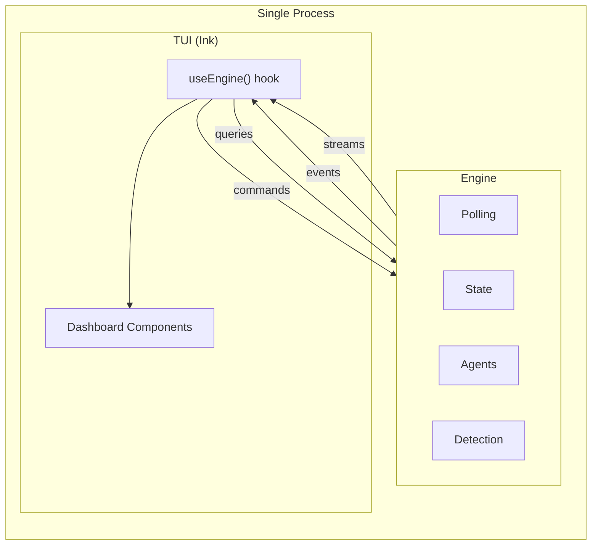

# Agentic Workflow Control Plane

## Overview

The control plane is an interactive, long-running TUI application that operates the development workflow defined in `workflow.md`. It monitors GitHub Issues and spec files for state changes, automatically dispatches agents where policy allows, surfaces actionable items to the user, and provides on-demand agent invocation for tasks requiring human judgment.

It is the single interface through which the Human role interacts with the automated workflow — observing state, dispatching agents, and responding to notifications.

## Constraints

- Must be manually started. Does not auto-start or run as a system service.
- Must remain interactive while agents run. The user can observe, dispatch, and respond at any time.
- Must not invoke agents concurrently for the same task issue. One agent per issue at a time.
- Must auto-recover stale `status:in-progress` issues when no agent is running for them (reset to `status:pending`).
- Must only auto-dispatch the Planner for specs with `status: approved` in frontmatter.
- Must use `@octokit/rest` with `@octokit/auth-app` for all GitHub API interactions.
- Must use `@anthropic-ai/claude-agent-sdk` for all agent invocations.

## Specification

### Architecture

The control plane consists of two co-located modules in a single process:

- **Engine** — Polling, state management, change detection, agent lifecycle, and dispatch logic. Owns all workflow state. Has no knowledge of the TUI.
- **TUI** — Ink-based (React for terminal) dashboard that renders engine state and captures user input. Consumes the engine; never imported by it.

Both modules live in the `@sear/agentic-workflow` workspace package at `agentic-workflow/` in the repository root. They are separate modules with explicit exports, not separate packages.

### Data Flow

The engine exposes four interfaces:

1. **Event emitter** — The engine emits typed events when state changes occur (issue status changed, agent started, agent completed, change detected, etc.). The TUI subscribes to these events for reactive state updates.
2. **Command interface** — The engine accepts commands (dispatch implementor for issue N, cancel agent for issue N, shutdown, etc.). The TUI invokes these in response to user input.
3. **Query interface** — The engine provides on-demand data fetching (issue details, PR summaries). The TUI calls these when the user selects an issue that needs additional data not tracked by pollers.
4. **Stream accessor** — The engine exposes live agent output streams, keyed by issue number. Planner sessions are not exposed through this interface (the Planner operates on specs, not task issues; its activity is visible only through notification events). The TUI subscribes to these directly for streaming agent output in the detail pane, separate from the event emitter.

The TUI bridges these interfaces to React via a Zustand store initialized by a `useEngine()` hook:

- The store subscribes to engine events in its initializer and updates state reactively.
- Store actions wrap engine commands.
- Components use `useStore()` with selectors to subscribe to specific state slices.
- This hook is the only coupling point between engine and TUI.

### Dispatch Tiers

The control plane categorizes state changes into three tiers that determine how they are handled:

| Tier | Behavior | Triggers |
|------|----------|----------|
| **Auto-dispatch** | Agent invoked automatically, no user action needed | Spec changes (approved only) → Planner |
| **Completion-dispatch** | Agent invoked automatically after a preceding agent completes | Implementor completes + linked non-draft PR exists → Reviewer (engine sets `status:review`) |
| **User-dispatch** | Surfaced in TUI, user chooses when to invoke | Issues with `status:pending`, `status:unblocked`, `status:needs-changes` → Implementor |
| **Notify-only** | User notified for action outside the control plane | `status:needs-refinement` (with clipboard command), `status:blocked` (URL only), `status:approved` (ready to merge) |

Dispatch decisions are based on status labels, dispatch tier classification, and agent completion signals. The engine does not enforce task dependencies (e.g., "Blocked by #X" references in issue bodies). Dependency ordering is the Human's responsibility when deciding which user-dispatch tasks to invoke.

The engine determines the tier. The TUI renders accordingly — auto-dispatched and completion-dispatched agents appear as running, user-dispatch items appear as actionable, and notifications appear with copy-to-clipboard commands.

Notifications are dismissed automatically when the underlying issue status changes.

### Agent Invocation

Agents are invoked programmatically using the `@anthropic-ai/claude-agent-sdk`. Each agent is configured with a system prompt from its agent definition file (`.claude/agents/<agent>.md`) and receives trigger-specific context (issue number, changed spec file paths, etc.).

The SDK provides structured lifecycle management — the engine creates agent sessions, monitors their progress, and handles completion without subprocess coordination.

The Planner receives all changed spec paths from the poll cycle in a single invocation (batched, not per-file).

The Reviewer is dispatched when an Implementor agent session completes and a linked non-draft PR exists for the issue. The engine checks for the PR on Implementor completion, sets `status:review` on the issue, and dispatches the Reviewer atomically. This ensures the Reviewer is never dispatched without a PR to review. If the Implementor completes without a linked PR (e.g., PR creation failed, or the Implementor hit a blocker), no Reviewer is dispatched — the issue remains `status:in-progress` and crash recovery resets it to `status:pending`. The `status:review` label is not a dispatch trigger — the IssuePoller tracks it for display purposes only.

### Recovery

The engine performs status recovery in two cases:

1. **Startup recovery** — On initialization, any issue with `status:in-progress` and no running agent is reset to `status:pending`.
2. **Crash recovery** — If an agent session completes (success or failure) and the issue is still `status:in-progress`, the engine resets it to `status:pending`.

Reviewers do not change issue status to `in-progress`, so crash recovery does not apply to Reviewer failures. A failed Reviewer leaves the issue in `status:review` — the user can retry via the TUI.

The engine writes to GitHub Issues in two cases: recovery (status label resets) and Reviewer dispatch (setting `status:review`). All other GitHub writes are performed by the agents themselves.

### Technology

| Choice | Detail |
|--------|--------|
| Language | TypeScript |
| Execution | `tsx` (no build step) |
| Package | `@sear/agentic-workflow` at `agentic-workflow/` |
| Run command | `yarn agentic-workflow` |
| TUI framework | Ink (React for terminal) |
| TUI state management | Zustand |
| GitHub API | `@octokit/rest` |
| GitHub Auth | `@octokit/auth-app` |
| Agent invocation | `@anthropic-ai/claude-agent-sdk` |
| Configuration | TypeScript config file |

### API Duality

Agents and the engine use different GitHub API clients by design:

- **Agents** use the `gh` CLI via `scripts/workflow/gh.sh`, which handles authentication and token caching automatically.
- **Engine** uses `@octokit/rest` with `@octokit/auth-app`, authenticated via GitHub App credentials in config. Token refresh is handled automatically.

Consequences for implementors:
- No code sharing for GitHub operations between engine and agents.
- Different error shapes and retry patterns — `gh` returns exit codes and stderr; `@octokit/rest` throws typed errors.
- The control plane never uses `gh` CLI; agents never use `@octokit/rest`.

### Worktree Isolation

Each Implementor agent runs in a dedicated git worktree, isolating parallel implementors from each other and from the main working tree.

**Lifecycle:**

1. **Create on dispatch** — When the engine dispatches an Implementor for issue N, it creates a worktree before creating the agent session. The worktree strategy depends on whether a linked PR already exists (see Worktree Strategy below).
2. **Agent runs in worktree** — The agent session is created with its working directory set to the worktree path. All file operations are isolated to that worktree.
3. **Always cleanup** — When the agent session completes (success or failure), the engine removes the worktree via `git worktree remove`. The branch is the durable artifact — it persists in the local repository after worktree removal, and on the remote if the Implementor pushed. Previous attempt branches are preserved for inspection.

**Worktree Strategy:**

The engine selects between two strategies based on whether a linked PR exists for the issue at dispatch time:

| Condition | Strategy | Branch | Base |
|-----------|----------|--------|------|
| No linked PR (new task, retry after failure) | **Fresh branch** | `issue-<N>-<timestamp>` | Current `main` |
| Linked PR exists (resume from `needs-changes`, `unblocked`) | **PR branch** | PR's `headRefName` | Existing PR branch |

The fresh-branch strategy uses `issue-<N>-<timestamp>` where `<timestamp>` is epoch milliseconds (e.g., `issue-42-1739000000`). Each dispatch attempt gets a unique branch, so previous attempts' branches remain for inspection. The PR-branch strategy creates a worktree from the existing PR's head branch, so the Implementor resumes exactly where the previous session left off.

PR detection for strategy selection uses `getPRForIssue` with draft inclusion — any linked PR (draft or non-draft) indicates a resume scenario.

**Naming:**

| Artifact | Convention | Example |
|----------|------------|---------|
| Branch (new) | `issue-<number>-<timestamp>` | `issue-42-1739000000` |
| Branch (resume) | PR's `headRefName` | `issue-42-1739000000` (from previous attempt) |
| Worktree directory | `<repo-root>/.worktrees/<branch-name>` | `.worktrees/issue-42-1739000000` |

**Constraints:**

- The `.worktrees/` directory must be added to `.gitignore`.
- Only Implementor agents use worktrees. Planner and Reviewer agents operate on the main working tree.
- The Implementor pushes on the branch it starts on. It does not rename the branch.

## Acceptance Criteria

- [ ] Given the control plane is started, when startup completes, then the TUI renders and the engine begins polling.
- [ ] Given a spec with `status: approved` is committed, when the next poll cycle runs, then the Planner is auto-dispatched without user interaction.
- [ ] Given an Implementor agent session completes for issue N, when a linked non-draft PR exists, then the engine sets `status:review` on the issue and dispatches the Reviewer.
- [ ] Given an Implementor agent session completes for issue N, when no linked non-draft PR exists, then no Reviewer is dispatched and the issue remains `status:in-progress` (crash recovery resets to `status:pending`).
- [ ] Given `status:review` is detected by the IssuePoller (set externally or by the engine), when the change is processed, then no Reviewer is auto-dispatched — `status:review` is not a dispatch trigger.
- [ ] Given a task issue is `status:pending`, when the TUI displays it, then the user can dispatch an Implementor for it on demand.
- [ ] Given a task issue moves to `status:needs-refinement`, when the TUI displays the notification, then a clipboard-ready CLI command is provided.
- [ ] Given a notification's underlying issue status changes, when the next poll cycle runs, then the notification is dismissed.
- [ ] Given an agent is running, when the user presses a key, then the TUI processes the keypress and re-renders within one render cycle (no blocking on agent I/O).
- [ ] Given the engine emits an event, when the TUI is subscribed, then the TUI re-renders to reflect the new state.
- [ ] Given an issue is `status:in-progress` with no running agent at startup, when initialization completes, then the issue is reset to `status:pending`.
- [ ] Given an agent session completes and the issue is still `status:in-progress`, when the completion is detected, then the issue is reset to `status:pending`.
- [ ] Given the engine dispatches an Implementor for issue N with no linked PR, when the worktree is created, then it uses a fresh branch `issue-<N>-<timestamp>` from `main`.
- [ ] Given the engine dispatches an Implementor for issue N with a linked PR, when the worktree is created, then it uses the PR's head branch.
- [ ] Given an Implementor agent session completes (success or failure), when cleanup runs, then the worktree is removed and the branch is preserved.
- [ ] Given the engine sets `status:review` on an issue, when the label is set, then the engine emits a synthetic `issueStatusChanged` event so the TUI updates immediately.

## Dependencies

- `control-plane-engine.md` — Engine specification (polling, state, dispatch logic, agent lifecycle)
- `control-plane-tui.md` — TUI specification (layout, interactions, rendering)
- `workflow.md` — Development workflow definition (roles, phases, status transitions)
- `agent-planner.md` — Planner agent definition
- `agent-implementor.md` — Implementor agent definition
- `agent-reviewer.md` — Reviewer agent definition

## References

